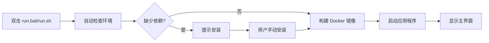

# OptiKG 信息抽取工具 - Docker 版

## 📋 项目简介
基于深度学习的信息抽取系统，能够从技术文档中自动提取「部件-故障-工具」三元组，并可视化知识图谱。

**技术栈**：Qt6 + ONNX Runtime + Tokenizers-cpp + SQLite

## 🎯 核心功能
1. **智能文本分析**：输入技术文档段落，自动识别实体和关系
2. **知识图谱可视化**：交互式图谱展示，支持拖拽和缩放
3. **历史记录管理**：SQLite 数据库保存所有抽取记录
4. **批量处理**：支持批量导入和导出（JSON/CSV）
5. **多语言界面**：中英文切换

## 🚀 快速启动（三选一）

### 方案一：一键启动（推荐）
| 操作系统 | 操作步骤 |
|----------|----------|
| **Windows** | 1. 确保已安装 Docker Desktop<br>2. **双击** `run.bat`<br>3. 按提示安装 VcXsrv（仅首次） |
| **Mac/Linux** | 1. 确保已安装 Docker<br>2. 终端执行：`chmod +x run.sh`<br>3. **双击** `run.sh` 或终端执行 `./run.sh` |

### 方案二：手动命令
```bash
# 进入项目目录
cd docker-build

# 构建镜像（首次或更新代码后）
docker-compose build

# 启动应用
docker-compose up

# 关闭按 Ctrl+C
```

### 方案三：直接运行镜像（已构建好）
```bash
# 从 Docker Hub 拉取（如果已上传）
docker pull yourname/optikg:latest

# 运行
docker run -it --rm \
  -e DISPLAY=host.docker.internal:0 \
  -v /tmp/.X11-unix:/tmp/.X11-unix \
  yourname/optikg:latest
```

## 📦 系统要求
| 项目 | 最低要求 | 推荐配置 |
|------|----------|----------|
| **操作系统** | Windows 10 / macOS 10.15+ / Ubuntu 20.04+ | Windows 11 / macOS 12+ |
| **Docker** | Docker Desktop 4.12+ | Docker Desktop 4.20+ |
| **内存** | 4 GB RAM | 8 GB RAM |
| **存储** | 2 GB 可用空间 | 5 GB 可用空间 |
| **网络** | 能访问 Docker Hub | 稳定的网络连接 |

## 🔧 前置安装（首次运行前）

### 1. 安装 Docker Desktop
- **Windows/Mac**：[官网下载](https://www.docker.com/products/docker-desktop)
- **Linux**：
  ```bash
  curl -fsSL https://get.docker.com | sh
  sudo usermod -aG docker $USER
  ```

### 2. 安装 X11 服务器（仅 Windows）
- **VcXsrv**：[下载地址](https://sourceforge.net/projects/vcxsrv/)
- 安装后启动配置：
  ```
  ① Multiple windows
  ② Display number: 0
  ③ ✔ Disable access control (重要！)
  ④ 其他默认
  ```

### 3. 安装 XQuartz（仅 macOS）
```bash
brew install --cask xquartz
# 安装后重启电脑
```

## 🖥️ 使用指南

### 1. 首次运行流程


### 2. 基本操作
1. **输入文本**：在左侧文本框粘贴技术文档
2. **点击抽取**：自动分析文本并提取三元组
3. **查看结果**：
   - 中间表格：结构化结果
   - 右侧图谱：可视化关系
   - 底部历史：保存的记录

### 3. 高级功能
| 功能 | 操作位置 | 说明 |
|------|----------|------|
| **批量处理** | 文件 → 批量处理 | 导入多个文本文件 |
| **导出结果** | 文件 → 导出 | JSON/CSV 格式 |
| **切换语言** | 设置 → 语言 | 中英文切换 |
| **调整阈值** | 设置 → 模型参数 | 控制抽取精度 |

## ⚠️ 常见问题

### Q1: 启动后看不到窗口
- **Windows**：检查 VcXsrv 是否运行，任务栏应有图标
- **Mac**：检查 XQuartz 是否启动（应用程序→实用工具）
- **Linux**：确保在图形界面下运行，非 SSH 连接

### Q2: Docker 构建失败
```bash
# 尝试以下步骤：
1. 检查网络：docker pull ubuntu:22.04
2. 清理缓存：docker system prune -a
3. 增加内存：Docker Desktop → Resources → Memory (≥4GB)
```

### Q3: 运行速度慢
- 首次构建需下载基础镜像（约 1GB）
- 后续启动约 10-20 秒
- 可关闭其他 Docker 容器释放资源

### Q4: 如何保存数据？
- 所有数据保存在 `docker-build/data/` 目录
- 删除容器不会丢失数据
- 备份时复制此目录即可

## 📁 目录结构
```
docker-build/
├── Dockerfile              # 容器构建配置
├── docker-compose.yml      # 服务编排配置
├── run.sh                  # Linux/Mac 启动脚本
├── run.bat                 # Windows 启动脚本
├── README_老师专用.md       # 本文件
└── data/                   # 持久化数据（运行时自动创建）
```

## 🎓 大作业说明

### 项目亮点
1. **完整工作流**：从文本输入到知识图谱可视化
2. **跨平台部署**：Docker 容器化，一键运行
3. **生产级架构**：模块化设计，易于扩展
4. **用户体验**：直观界面，实时反馈

### 技术难点与解决方案
| 难点 | 解决方案 |
|------|----------|
| 跨平台兼容性 | Docker 容器化 + X11 转发 |
| 深度学习部署 | ONNX Runtime + 模型优化 |
| 依赖管理 | 静态链接 + 子模块管理 |
| 性能优化 | 异步推理 + 分块处理 |

### 测试用例
提供 `test_cases.txt` 文件，包含：
1. 简单技术文档（5-10 句子）
2. 复杂故障描述（含多个实体）
3. 边界测试（空文本、超长文本）

## 📞 支持与反馈
- **问题报告**：运行 `docker-compose logs > error.log` 导出日志
- **功能建议**：项目已开源，欢迎贡献代码
- **紧急联系**：学生姓名 + 学号 + 课程名称

---

**祝您使用愉快！如有任何问题，请随时联系学生。**

> 项目版本：v1.0.0 | 最后更新：2026-04-05 | 课程：软件工程大作业