SourceURL:file:///home/arch/Downloads/软件工程大作业.docx

# 第1章 系统定义

## 1.1 项目背景

在高端装备制造、能源电力、轨道交通等工业领域，设备运维过程中积累了海量的经验性知识，包括维修日志、故障诊断报告、技术手册、工艺规程等非结构化文本数据，这些文档蕴含着宝贵的隐性知识，是企业核心竞争力的重要组成部分。然而，当前工业知识管理面临着知识分散化与检索困难、知识流失风险加剧等严峻挑战。工业文档通常以多种格式散落在各个部门的信息系统中，缺乏统一的语义索引，技术人员在排查故障时往往需要耗费大量时间翻阅历史文档，甚至依赖资深专家的个人经验，导致问题解决效率低下。同时，随着资深技术人员的退休或流动，大量基于经验的故障判断逻辑和维修技巧未能有效沉淀，而传统的人工整理方式不仅成本高昂，且难以保证知识的完整性和准确性。与此同时，国家大力推进智能制造与工业互联网建设，《“十四五”智能制造发展规划》《工业互联网创新发展行动计划》等政策文件明确提出要推动工业知识图谱的构建与应用，提升工业软件的自主可控能力。在此背景下，如何利用人工智能技术将分散的工业经验转化为结构化的、可复用的知识资产，成为企业数字化转型中的重要课题。

## 1.2 产品定位

OptiKG（Optimized Industrial Knowledge Graph）是一款面向工业领域的轻量化离线知识抽取与可视化分析系统。系统基于 C++ 与 Qt6 框架开发，集成 ONNX Runtime 深度学习推理引擎，能够在完全离线、无网络依赖的环境下，从维修日志、故障报告、技术手册等非结构化文本中自动抽取“部件—故障—工具—组成”四类关键实体及其关联关系，形成结构化的知识三元组，并通过交互式图谱直观展示实体间的复杂关联。产品核心价值体现在五个维度：在安全性方面，纯本地运行确保数据不出内网，满足军工、能源等敏感行业的保密要求；在高效性方面，基于 C++ 原生编译与 ONNX 推理优化，相对于传统python实现的NLP软件响应速度提升；在易用性方面，图形化界面设计使一线技术人员无需编程基础即可上手；在可扩展性方面，模块化架构支持自定义实体类型、关系类别和置信度阈值；在批量化方面，支持 JSON/CSV 格式批量导入，自动化处理千级文档规模。系统主要服务于工业企业设备运维部门、质量管理部门和技术研发中心，典型应用场景包括航空发动机维修日志的知识挖掘、风电机组故障案例的结构化归档、高铁动车组检修记录的智能检索以及石化装置工艺异常的经验沉淀。

在技术架构上，OptiKG 采用分层渐进式融合策略，当前版本聚焦于核心抽取能力建设。系统基于 Qt6 Widgets 构建跨平台桌面应用，利用其成熟的工业软件生态；集成 ONNX Runtime 1.16.3 作为推理引擎，实现高性能、多后端支持的模型推理；采用 tokenizers-cpp 提供 HuggingFace 生态兼容的分词能力，支持 BPE、WordPiece 等多种算法；使用 SQLite 嵌入式数据库实现零配置的数据持久化；通过 Qt Concurrent 简化多线程编程，优化批量处理性能。系统在关键技术层面实现了多项创新：针对工业文档篇幅较长的特点，实现了滑动窗口分块机制，在保证上下文连贯性的同时避免资源溢出；提供动态置信度过滤功能，用户可实时调整阈值以平衡召回率与准确率；通过 SQLite 数据库持久化存储历史抽取结果，支持同一实体的多次出现合并与冲突关系的优先级判定；基于 QGraphicsView 框架实现的知识图谱支持节点拖拽、缩放、悬停高亮、关联路径追踪等交互操作，显著提升知识探索效率。

相较于云端 API 服务和开源 NLP 工具包，OptiKG 在离线能力、数据安全、部署复杂度、领域适配、可视化能力和批量处理等方面具有显著优势。系统定位于工业知识工程领域的轻量级基础设施，填补了中小型制造企业低成本解决方案、敏感行业合规性选择以及科研机构实验验证平台的市场空白。

## 1.3 用户单位存在的问题

典型工业企业的设备管理部门为例，当前普遍面临知识获取效率低下的困境。大量宝贵的维修经验记录在纸质日志或分散的电子文档中，这些非结构化数据缺乏统一的语义索引和检索机制，技术人员在面对突发故障时往往需要耗费数小时甚至数天时间翻阅历史档案，无法快速定位相似案例以支撑决策，导致设备停机时间延长，直接影响生产效率和经济效益。与此同时，隐性知识流失问题日益严峻，资深维修人员凭借多年实践积累的故障诊断直觉、维修技巧和问题解决逻辑等隐性知识未能通过系统化手段进行有效留存和传承，一旦这些核心技术人员因退休、跳槽或其他原因离开岗位，企业多年积累的知识资产便随之流失，新员工需要重新经历漫长的学习曲线，造成重复性试错成本的持续增加。更为突出的是，故障链条缺乏清晰的结构化梳理。部件、故障现象、检测工具、维修方法之间的复杂关联关系散落在不同文档中，缺乏系统性的图谱化呈现，导致故障排查路径不明确，技术人员难以从全局视角理解故障的传导机制和根因逻辑，常常陷入被动局面，重复性工作频繁发生，相同类型的故障在不同班组、不同时间段被反复处理却未能形成标准化的解决方案库。此外，数据与业务存在严重脱节现象，现有的数据分析工具往往由 IT 部门或外部供应商提供，与实际维修操作流程分离，界面复杂、学习成本高，一线维修人员难以在日常工作中便捷地获取智能化辅助支持，导致先进的自然语言处理、知识图谱等技术成果停留在实验室或管理层报表层面，未能真正下沉到生产现场转化为实际生产力，形成了“有数据无应用、有技术无落地”的尴尬局面，制约了企业数字化转型的深度推进。

## 1.4 产品开发目的

基于上述行业背景与用户痛点分析，OptiKG 的开发旨在通过技术创新解决工业知识管理的核心难题，具体目标涵盖三个维度。首先，实现工业知识的自动化抽取，替代传统低效的人工阅读与整理模式。系统利用深度学习模型自动从非结构化文本中识别实体与关系，将原本需要数小时甚至数天的人工归纳工作压缩至秒级完成，显著提升知识获取效率，使技术人员能够从繁琐的信息筛选工作中解放出来，专注于高价值的故障诊断与决策分析。其次，打造高性能的工业级软件产品，确保系统在完全离线、低资源消耗的环境下稳定运行。通过 C++ 原生编译与 ONNX Runtime 推理引擎的深度优化，系统无需依赖云端算力或网络连接，既满足了军工、能源等敏感行业对数据安全的严苛要求，又保证了在普通办公电脑上的流畅体验，实现真正的“开箱即用”。最后，支撑知识的可视化管理与可持续积累。系统不仅提供结构化的三元组数据，更通过交互式知识图谱直观呈现“部件—故障—工具”之间的复杂关联，帮助企业构建动态更新的知识资产库，避免因人员流动导致的隐性知识流失，形成可传承、可检索、可复用的企业智慧中枢。

## 1.5 生命周期模型选择

本项目采用增量模型（Incremental Model）作为软件开发的生命周期模型，主要基于以下四方面考量。第一，核心知识抽取功能具备独立交付价值，可通过最小可行产品（MVP）快速验证技术可行性与市场接受度。在首个增量版本中，系统集中资源实现文本输入、模型推理、三元组输出等核心链路，确保用户能够立即体验到自动化抽取带来的效率提升，从而建立信心并获取早期反馈。第二，系统架构支持模块化扩展，便于后续逐步增加知识图谱可视化、历史检索、人工审核管理、批量处理等增量模块。每个新增功能均作为独立的增量单元进行开发与集成，既降低了单次迭代的复杂度，又确保了系统整体架构的清晰性与可维护性。第三，每个增量版本均为可独立运行的完整系统，便于用户在实际工作场景中进行试用与评估。这种“边开发、边交付、边反馈”的模式使得开发团队能够根据一线用户的真实需求及时调整功能优先级与设计细节，避免传统瀑布模型中“闭门造车”导致的产品偏离风险，实现以用户价值为导向的持续优化。第四，增量模型符合工业软件“先核心后扩展”的演进规律，有效降低技术风险与管理成本。工业领域业务逻辑复杂、用户需求多样，若试图在初期一次性完成所有功能设计，极易因需求变更或技术瓶颈导致项目延期甚至失败，通过分阶段交付，团队能够在每个增量周期内聚焦特定目标，逐步完善系统能力。


# 第2章 项目可行性论证

## 2.1 技术可行性

OptiKG 的技术核心是基于深度学习的工业文本三元组抽取技术，通过 C++ 与 ONNX Runtime 推理引擎的深度集成，实现高性能的离线知识抽取。

在算法层面，命名实体识别与关系抽取技术已在工业文本处理领域得到充分验证与广泛应用。本项目采用成熟的预训练语言模型作为基础架构，通过模型微调适配工业领域术语与表达习惯，并利用 ONNX 格式完成模型导出与部署。ONNX Runtime 作为微软开源的高性能推理引擎，提供标准化的模型执行环境。

在技术栈层面，C++ 作为工业级软件的主流开发语言，具备执行效率高、资源占用低、跨平台兼容性强等优势，特别适用于对性能与稳定性要求严苛的工业场景。ONNX Runtime 提供完整的 C++ API 接口，支持模型加载、推理执行、张量操作等核心功能，且社区活跃、文档完善。Qt6 框架则为系统提供成熟的 GUI 开发能力与跨平台部署支持，结合 SQLite 嵌入式数据库实现数据持久化，整体技术栈均为主流且经过工业验证的组件，团队具备相关的技术储备与开发经验，技术风险可控。

为直观展示技术方案的优势，下表对比了传统 Python 脚本方案与 OptiKG C++ 方案在关键指标上的差异：

| ***\*特性\****     | ***\*传统Python脚本方案\**** | ***\*OptiKGC++方案\**** |
| ------------------ | ---------------------------- | ----------------------- |
| ***\*启动速度\**** | 缓慢（加载PyTorch）          | 秒开                    |
| ***\*内存占用\**** | 3GB-8GB                      | 500MB-1.2GB             |
| ***\*环境依赖\**** | 大量第三方库，配置复杂       | 零依赖，解压即用        |
| ***\*隐私安全\**** | 部分方案需上传云端处理       | 完全离线，数据不出内网  |

综上分析，OptiKG 在算法成熟度、技术栈稳定性、性能表现及演进扩展性等方面均具备充分的技术可行性，能够支撑工业场景下的可靠部署与长期运维。

## 2.2 经济可行性

在开发成本方面，本项目具备显著的成本优势。开发团队主要由在校学生构成，人力成本相对较低。在开发工具链选择上，系统采用 C++ 与 Qt6 开源框架，ONNX Runtime 为微软开源的高性能推理引擎，SQLite 为嵌入式数据库，tokenizers-cpp 基于开源生态构建，所有核心组件均采用开源许可或社区免费版，无需支付昂贵的商业软件授权费用。在模型训练环节，可借助 Kaggle、Google Colab 等免费计算平台完成模型微调与优化，进一步降低前期研发投入。整体开发周期可控，资源投入主要集中在算法调优与系统集成，资金压力较小。

在运行成本方面，OptiKG 采用完全离线部署模式，彻底消除了传统 AI 应用对云端算力的依赖。系统无需支付云服务器租赁费、API 调用费或网络带宽费用，大幅降低长期运营成本。在硬件要求上，系统经过 C++ 原生编译与 ONNX Runtime 深度优化，内存占用控制在 500MB 至 1.2GB 之间。此外，零依赖的部署方式使得系统维护成本极低，一线 IT 人员仅需解压文件即可完成部署，后续升级仅需替换模型文件，无需复杂的环境配置与依赖管理，显著降低企业的运维人力投入。

在经济效益方面，系统为用户单位带来直接且可观的投资回报。通过自动化知识抽取替代人工文档整理，技术人员在故障排查时可快速获取历史案例与关联知识，预计缩短故障诊断与处理时间 20% 以上。同时，系统帮助企业在人员流动背景下实现隐性知识的系统化留存，避免因技术骨干离职导致的重复试错成本，从长远来看，知识资产的积累与复用将为企业创造持续的竞争优势。综合考虑开发投入与运行成本，系统投资回收期短，经济可行性良好，具备较高的推广价值与市场竞争力。

## 2.3 操作可行性

立可执行文件及配套的模型资源目录，用户无需进行复杂的安装向导或修改现有的 IT 基础设施配置，只需将软件包拷贝至目标计算机，解压即可直接运行，彻底消除了传统工业软件部署中常见的环境依赖冲突、注册表修改及权限配置等痛点。

在使用流程与交互体验方面，系统遵循“极简主义”设计理念，核心操作链路缩短至三步：导入文本、点击抽取、查看图谱。图形用户界面基于 Qt6 框架构建，布局直观清晰，控件符合直觉操作习惯。系统提供实时进度反馈与状态提示，一线维修人员无需具备编程基础或复杂的系统培训即可快速上手，显著降低了技术门槛，确保先进的人工智能能力能够真正下沉至生产现场，转化为实际生产力。

在数据兼容性方面，系统内置灵活的数据解析引擎，广泛支持纯文本（TXT）、结构化表格（CSV/JSON）等多种工业常用格式。针对历史文档数字化场景，系统提供批量导入功能，支持自定义字段映射与编码识别，能够无缝对接企业现有的文档管理体系。用户可根据实际需求选择单条即时抽取或千级文档批量处理，系统自动完成格式转换与内容清洗，确保多源异构数据的高效摄入与标准化处理。

在业务流程融合方面，OptiKG 具备高度的架构灵活性与集成能力。系统既可作为独立的知识探索工具供技术人员单独使用，也可通过预留的标准化接口与企业现有的设备管理系统、制造执行系统或故障诊断平台进行深度对接。

综上所述，OptiKG 在部署部署、操作交互、数据兼容及业务集成等方面均展现出优异的操作可行性，能够以最小的实施阻力快速融入工业企业的日常运维体系，具备广泛的适用性与推广潜力。

## 2.4 法律可行性

在知识产权与软件合规方面，OptiKG 严格遵循开源软件许可协议，确保所有第三方组件的使用均具备法律正当性。系统核心推理引擎 ONNX Runtime 采用宽松的 MIT 协议，允许商业闭源使用；跨平台 GUI 框架 Qt6 选用 LGPLv3 协议版本，通过动态链接方式集成，符合 LGPL 对闭源商业软件的分发要求；分词组件 tokenizers-cpp 及其依赖的 SentencePiece 均遵循 Apache 2.0 协议。开发团队在发布软件时将完整保留所有第三方组件的版权声明与许可证副本，严格履行开源协议规定的告知义务，从源头上规避了知识产权侵权风险，确保产品的商业化推广与开源生态的良性共存。

在数据隐私与安全监管方面，系统“完全离线”的技术特性构成了最坚实的法律合规基础。随着《中华人民共和国数据安全法》与《网络安全法》的深入实施，工业数据分类分级保护及关键信息基础设施的安全要求日益严格。OptiKG 无需将企业的敏感技术参数、设备参数或故障记录上传至云端服务器，所有数据处理均在本地计算节点闭环完成，彻底杜绝了数据跨境传输或云服务商泄露的法律隐患。

综上所述，OptiKG 在知识产权许可及数据合规监管导向上均无实质性法律障碍，为产品的合法合规运营与市场拓展提供了坚实的法律保障。

# 第3章 需求分析

SourceURL:file:///home/arch/Downloads/软件工程大作业.docx

## 3.1 用户顶级需求描述

### 3.1.1 产品需求简要描述

OptiKG是一款面向工业领域的离线知识抽取与图谱分析系统，旨在帮助工业企业从维修日志、故障报告、技术手册等非结构化文本中，自动提取结构化的知识三元组（部件-故障-工具-组成），并通过可视化图谱辅助故障诊断与知识管理。

***\*核心功能需求：\****

l 文本知识抽取：支持单条文本实时抽取和批量文件（JSON/CSV）处理，输出带置信度评分的实体关系三元组。

l 知识图谱可视化：以交互式力导向图展示实体间关联，支持节点拖拽、缩放、高亮聚焦等操作。

l 知识检索与导出：按关键词、实体类型等条件检索历史抽取结果，支持导出为JSON/CSV格式。

l 系统配置与管理：允许管理员调整置信度阈值、文本分块策略等参数，并管理用户权限与模型版本。

### 3.1.2 用户单位组织结构

以某汽车零部件制造企业设备管理部门为例：

 


***\*各角色主要职责如下：\****

l 部门主管：审批知识管理方案，监控系统使用效果。

l 知识管理者：审核抽取的三元组，保证知识质量，维护知识库。

l 设备工程师：核心用户，负责知识检索、录入、图谱查看及故障分析。

l IT运维人员：负责系统部署、数据备份、权限管理。

l 维修技术员：查询故障处理方法和工具，辅助现场维修决策。


## 3.2 基于结构化方法的需求分析

### 3.2.1 顶层DFD图（上下文图）

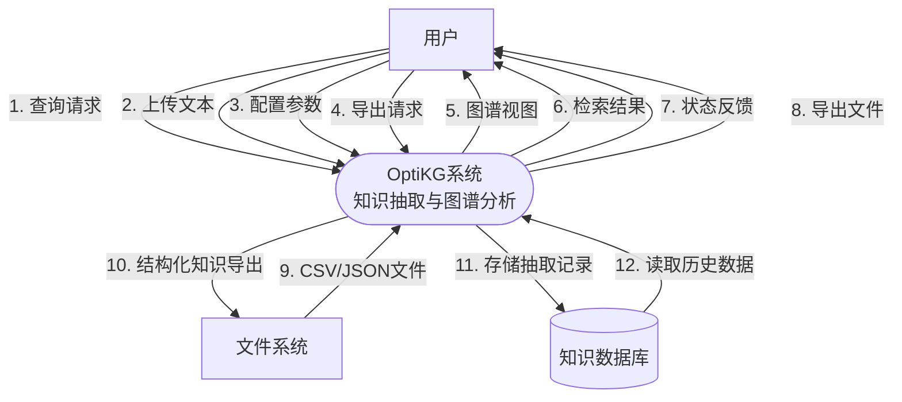

**顶层数据流说明：**

**外部实体**：
1. **用户**：设备工程师、维修技术员、知识管理员、IT运维人员
2. **文件系统**：存储维修记录文件的本地磁盘

**系统过程**：OptiKG系统（知识抽取与图谱分析）

**数据存储**：知识数据库（SQLite嵌入式数据库）

**主要数据流**：
1. **用户→系统**：查询请求、上传文本、配置参数、导出请求
2. **系统→用户**：图谱视图、检索结果、状态反馈、导出文件  
3. **文件系统→系统**：CSV/JSON格式的原始文本文件
4. **系统→文件系统**：结构化知识导出文件（JSON/CSV格式）
5. **系统↔数据库**：存储/读取抽取记录、实体、关系等数据

### 3.2.2 一层DFD图

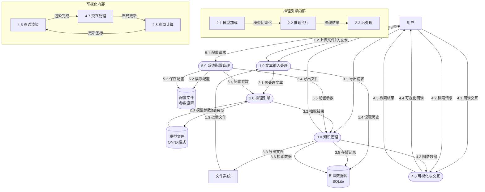

**一层DFD分解说明：**
- **1.0 文本输入处理**：接收用户输入文本或文件上传，支持TXT/CSV/JSON多种格式解析，进行文本预处理（清洗、去噪、编码转换）
- **2.0 推理引擎**：加载ONNX格式深度学习模型，执行命名实体识别和关系抽取，进行结果后处理（置信度过滤、去重）
- **3.0 知识管理**：存储抽取的三元组到数据库，支持检索、导入导出、批量操作等数据管理功能
- **4.0 可视化与交互**：知识图谱力导向布局渲染，支持节点拖拽、缩放、高亮等交互操作，提供历史记录检索界面
- **5.0 系统配置管理**：管理系统参数配置，包括置信度阈值、模型路径、界面主题等设置

**数据存储说明：**
- **知识数据库**：SQLite嵌入式数据库，存储抽取记录、实体、关系等结构化数据
- **模型文件**：ONNX格式的预训练模型文件，包含推理所需的权重和架构信息
- **配置文件**：JSON格式的系统参数配置文件，保存用户偏好和运行时设置

### 3.2.3 二层DFD图

#### 3.2.3.1 文本输入处理模块（1.0）二层DFD

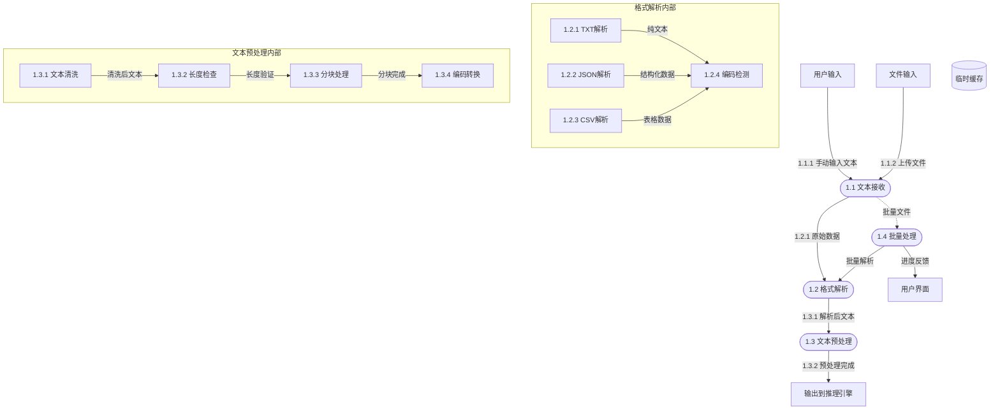

#### 3.2.3.2 推理引擎模块（2.0）二层DFD

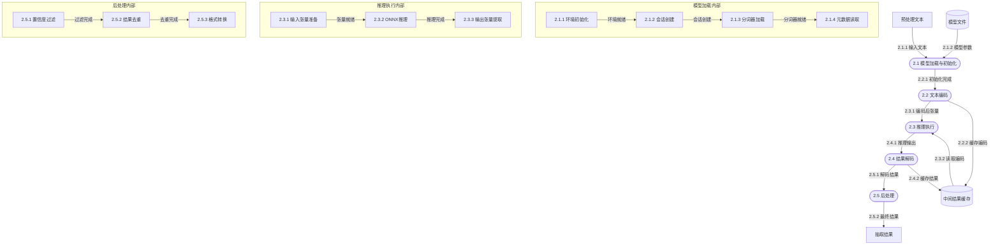

#### 3.2.3.3 知识管理模块（3.0）二层DFD

```mermaid
flowchart TD
    %% 输入输出
    Input3[抽取结果]
    UserRequest3[用户请求]
    Output3[管理结果]
    
    %% 数据存储
    MainDB[(知识数据库)]
    ExportCache[(导出缓存)]
    
    %% 处理过程
    P3_1([3.1 数据存储])
    P3_2([3.2 数据检索])
    P3_3([3.3 数据导出])
    P3_4([3.4 批量操作])
    P3_5([3.5 数据统计])
    
    %% 数据流
    Input3 --> |"3.1.1 待存储数据"| P3_1
    UserRequest3 --> |"3.2.1 检索条件"| P3_2
    UserRequest3 --> |"3.3.1 导出请求"| P3_3
    UserRequest3 --> |"3.4.1 批量请求"| P3_4
    
    P3_1 --> |"3.1.2 存储完成"| Output3
    P3_2 --> |"3.2.2 检索结果"| Output3
    P3_3 --> |"3.3.2 导出文件"| Output3
    P3_4 --> |"3.4.2 批量结果"| Output3
    P3_5 --> |"3.5.1 统计报告"| Output3
    
    %% 与数据库的交互
    P3_1 --> |"3.1.3 写入数据"| MainDB
    P3_2 --> |"3.2.3 查询数据"| MainDB
    MainDB --> |"3.2.4 返回数据"| P3_2
    P3_3 --> |"3.3.3 读取数据"| MainDB
    P3_4 --> |"3.4.3 批量读写"| MainDB
    P3_5 --> |"3.5.2 统计查询"| MainDB
    
    P3_3 --> |"3.3.4 缓存导出"| ExportCache
    ExportCache --> |"3.3.5 读取缓存"| P3_3
    
    %% 数据存储子过程
    subgraph P3_1_Details[数据存储内部]
        P3_1_1[3.1.1 记录插入]
        P3_1_2[3.1.2 实体存储]
        P3_1_3[3.1.3 关系存储]
        P3_1_4[3.1.4 事务提交]
        
        P3_1_1 --> |"记录ID"| P3_1_2
        P3_1_2 --> |"实体ID"| P3_1_3
        P3_1_3 --> |"关系ID"| P3_1_4
    end
    
    %% 数据检索子过程
    subgraph P3_2_Details[数据检索内部]
        P3_2_1[3.2.1 条件解析]
        P3_2_2[3.2.2 SQL生成]
        P3_2_3[3.2.3 查询执行]
        P3_2_4[3.2.4 结果组装]
        
        P3_2_1 --> |"解析条件"| P3_2_2
        P3_2_2 --> |"SQL语句"| P3_2_3
        P3_2_3 --> |"原始数据"| P3_2_4
    end
    
    %% 数据导出于过程
    subgraph P3_3_Details[数据导出内部]
        P3_3_1[3.3.1 JSON导出]
        P3_3_2[3.3.2 CSV导出]
        P3_3_3[3.3.3 格式转换]
        P3_3_4[3.3.4 文件生成]
        
        P3_3_1 --> |"JSON数据"| P3_3_3
        P3_3_2 --> |"CSV数据"| P3_3_3
        P3_3_3 --> |"格式化数据"| P3_3_4
    end
```

#### 3.2.3.4 可视化与交互模块（4.0）二层DFD

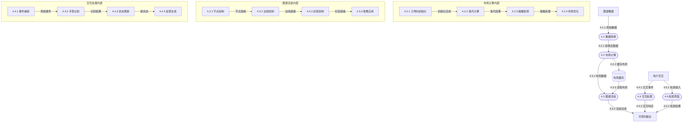

#### 3.2.3.5 系统配置管理模块（5.0）二层DFD

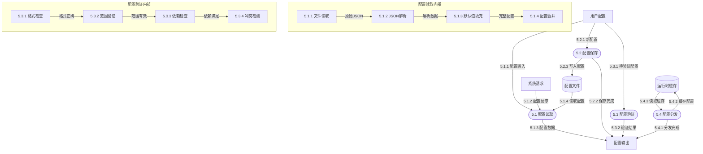

**二层DFD分解说明：**

每个模块的详细分解遵循标准DFD规范，展示了模块内部的处理过程、数据存储和数据流：
1. **文本输入处理模块**：包含文本接收、格式解析、预处理和批量处理四个主要过程，支持多种文件格式和编码
2. **推理引擎模块**：包含模型加载、文本编码、推理执行、结果解码和后处理五个主要过程，实现完整的深度学习推理流水线
3. **知识管理模块**：包含数据存储、检索、导出、批量操作和统计五个主要过程，提供全面的数据库管理功能
4. **可视化与交互模块**：包含数据转换、布局计算、图谱渲染、交互处理和检索界面五个主要过程，实现丰富的用户交互体验
5. **系统配置管理模块**：包含配置读取、保存、验证和分发四个主要过程，确保系统参数的一致性和有效性

所有DFD图均使用标准符号：圆角矩形表示处理过程，矩形表示外部实体，平行线表示数据存储，箭头表示数据流方向，虚线框表示过程内部细节。每个数据流都有唯一编号，便于追踪和引用。

### 3.2.4 三层DFD图

三层DFD对二层DFD中的关键处理过程进行进一步分解，展示最详细的内部数据流程。

#### 3.2.4.1 文本输入处理模块三层DFD

##### 3.2.4.1.1 格式解析子过程（1.2）

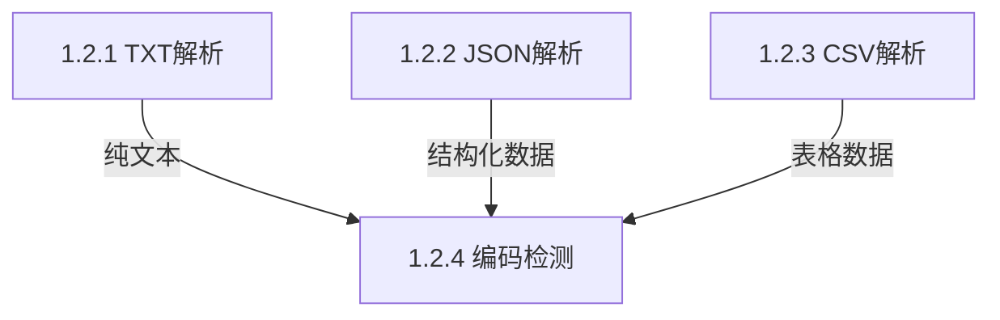

##### 3.2.4.1.2 文本预处理子过程（1.3）

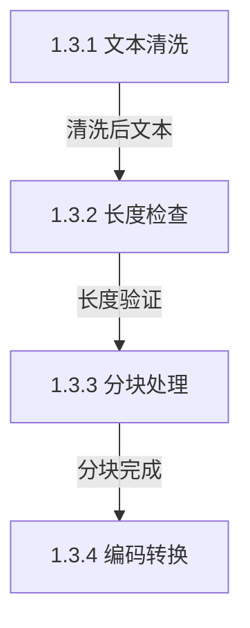

#### 3.2.4.2 推理引擎模块三层DFD

##### 3.2.4.2.1 模型加载子过程（2.1）

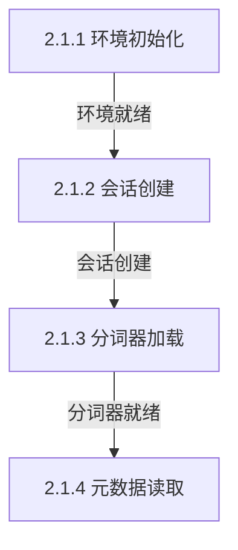

##### 3.2.4.2.2 推理执行子过程（2.3）

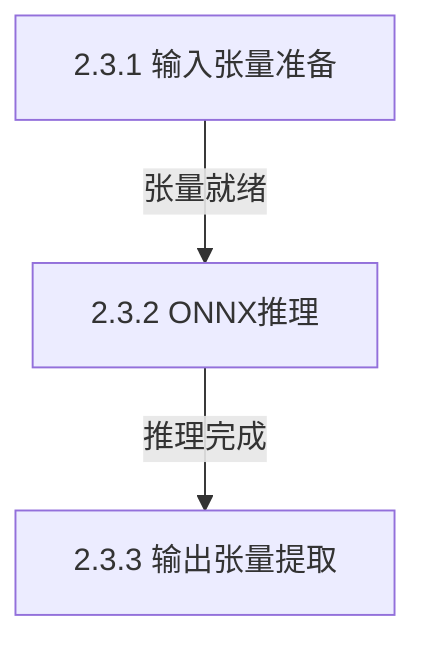

##### 3.2.4.2.3 后处理子过程（2.5）

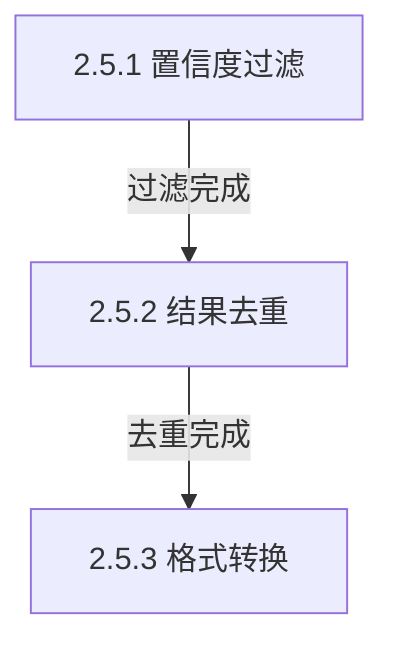

#### 3.2.4.3 知识管理模块三层DFD

##### 3.2.4.3.1 数据存储子过程（3.1）

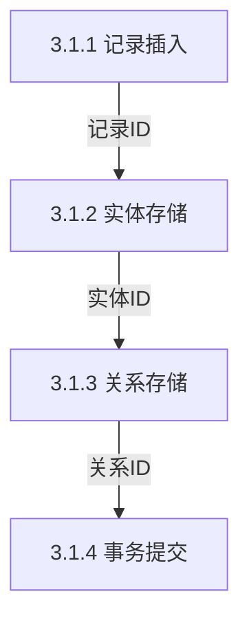

##### 3.2.4.3.2 数据检索子过程（3.2）

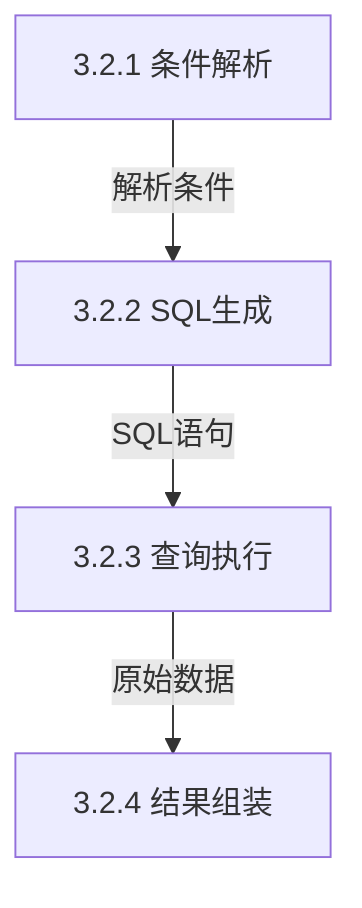

##### 3.2.4.3.3 数据导出于过程（3.3）

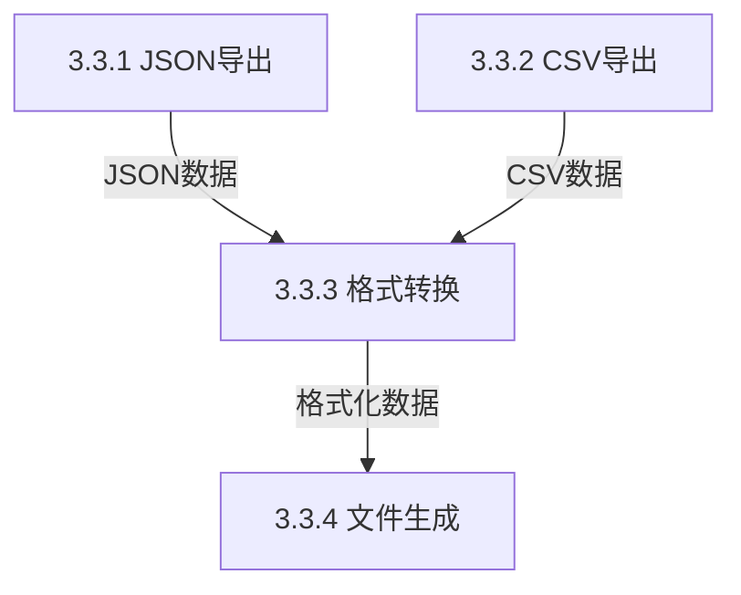

#### 3.2.4.4 可视化与交互模块三层DFD

##### 3.2.4.4.1 布局计算子过程（4.2）

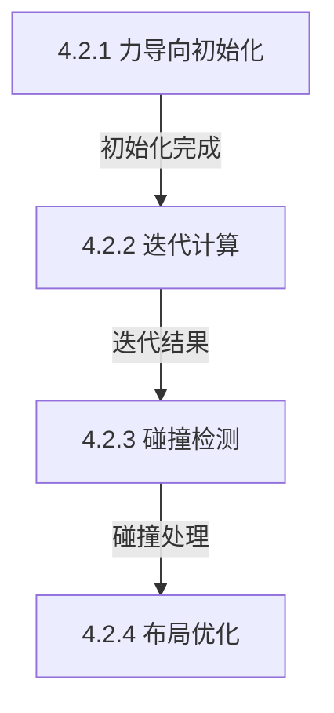

##### 3.2.4.4.2 图谱渲染子过程（4.3）

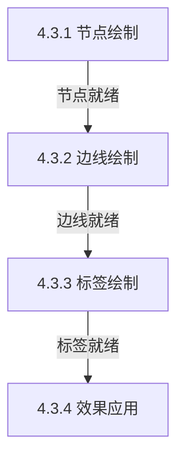

##### 3.2.4.4.3 交互处理子过程（4.4）

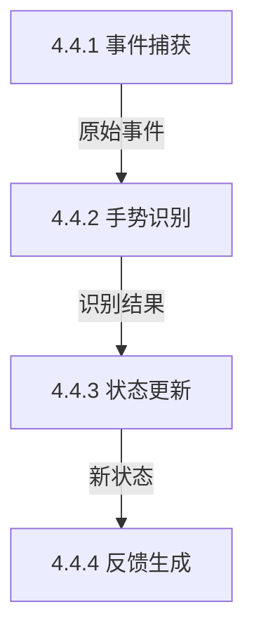

#### 3.2.4.5 系统配置管理模块三层DFD

##### 3.2.4.5.1 配置读取子过程（5.1）

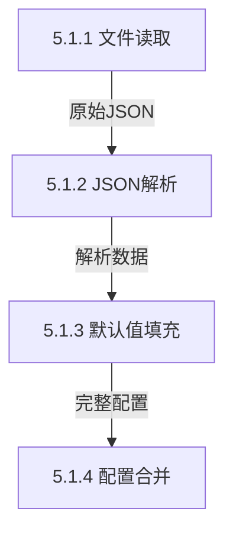

##### 3.2.4.5.2 配置验证子过程（5.3）

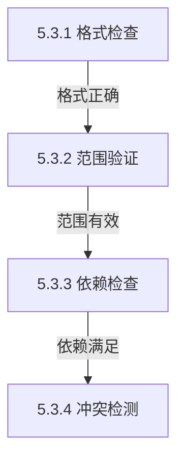

三层DFD对二层DFD中的关键处理过程进行进一步分解，展示系统最详细的数据处理流程，为系统实现提供精确的设计依据。

## 3.3 面向对象方法的需求分析

### 3.3.1 用户角色用例图

```mermaid
flowchart TD
    subgraph Actors[参与者]
        A1[设备工程师]
        A2[维修技术员]
        A3[知识管理员]
        A4[IT运维人员]
    end
    
    subgraph UseCases[主要用例]
        UC1[文本抽取<br/>上传文档]
        UC2[批量处理<br/>导入文件]
        UC3[知识图谱展示]
        UC4[历史记录管理]
        UC5[数据导出]
        UC6[系统配置]
        UC7[三元组审核]
        UC8[用户管理]
    end
    
    A1 --> UC1
    A1 --> UC3
    A1 --> UC4
    A1 --> UC5
    A2 -.-> UC3
    A2 -.-> UC4
    A3 --> UC7
    A4 --> UC6
    A4 --> UC8
    
    UC2 -.->|扩展| UC1
    UC7 -.->|包含| UC4
    UC8 -.->|关联| UC6
```

**主要用例说明：**

| 用例编号 | 用例名称     | 参与者       | 简要描述                         |
|----------|--------------|--------------|----------------------------------|
| UC1      | 文本抽取     | 设备工程师   | 输入维修文本，抽取实体和关系     |
| UC2      | 批量处理     | 设备工程师   | 导入批量文件，自动处理并生成报告 |
| UC3      | 知识图谱展示 | 所有用户     | 可视化展示三元组，支持交互操作  |
| UC4      | 历史记录管理 | 所有用户     | 查询、检索、删除历史记录         |
| UC5      | 数据导出     | 所有用户     | 导出JSON/CSV格式                |
| UC6      | 系统配置     | IT运维人员   | 配置推理参数、置信度阈值等       |
| UC7      | 三元组审核   | 知识管理员   | 审核、修正抽取的三元组           |
| UC8      | 用户管理     | IT运维人员   | 用户增删改查，角色分配           |

### 3.3.2 典型业务的顺序图

以"设备工程师上传维修日志并查看抽取结果"为例：

```mermaid
sequenceDiagram
    actor 用户 as 设备工程师
    participant UI as UI界面层
    participant Worker as 推理工作线程
    participant Engine as 推理引擎
    participant DB as 数据库管理
    participant Graph as 图谱渲染
    
    用户->>UI: 输入/粘贴维修文本
    UI->>UI: 文本预处理（去噪、规范化）
    UI->>Worker: 发送推理请求
    Worker->>Engine: 加载模型（如未加载）
    Engine->>Engine: 文本编码、推理计算
    Engine-->>Worker: 返回抽取结果（三元组列表）
    Worker->>DB: 存储抽取记录
    DB-->>Worker: 返回记录ID
    Worker-->>UI: 返回处理结果
    UI->>Graph: 生成图谱数据
    Graph->>Graph: 计算力导向布局
    Graph-->>UI: 返回渲染数据
    UI-->>用户: 展示知识图谱
    UI-->>用户: 显示三元组列表
    UI-->>用户: 状态提示（处理时间、置信度等）
```

**顺序图消息流说明：**
1. 用户在UI界面输入或粘贴维修文本
2. UI层进行文本预处理（去噪、长度检查等）
3. 启动推理工作线程，调用推理引擎
4. 推理引擎执行模型加载（如需）和推理计算
5. 返回抽取的三元组结果
6. 结果存储到数据库，生成记录ID
7. 图谱渲染模块处理数据，计算布局
8. 最终结果展示给用户

### 3.3.3 知识三元组状态图

```mermaid
stateDiagram-v2
    [*] --> 初始态: 用户输入文本
    初始态 --> 预处理中: 开始处理
    预处理中 --> 推理中: 文本编码完成
    推理中 --> 结果解码中: 模型推理完成
    结果解码中 --> 已完成: 结果解析成功
    结果解码中 --> 失败态: 解析错误
    已完成 --> 已存储: 保存到数据库
    已存储 --> [*]: 处理结束
    
    推理中 --> 取消态: 用户取消
    结果解码中 --> 取消态: 用户取消
    已完成 --> 取消态: 用户取消
    
    取消态 --> [*]: 清理资源
    失败态 --> [*]: 错误处理
```

**知识三元组状态说明：**
- **初始态**：用户输入文本，系统接收处理请求
- **预处理中**：文本清洗、分词、编码转换
- **推理中**：深度学习模型执行命名实体识别和关系抽取
- **结果解码中**：解析模型输出，生成结构化三元组
- **已完成**：成功生成知识三元组
- **已存储**：三元组持久化存储到数据库
- **取消态**：用户主动取消处理
- **失败态**：处理过程中出现错误

## 3.4 功能性需求分析

基于系统实际实现的功能模块，功能性需求分析如下：

| 编号  | 功能模块     | 功能描述                                                                 | 优先级 | 实现状态 |
|-------|--------------|--------------------------------------------------------------------------|--------|----------|
| FR-01 | 文本上传     | 支持TXT/CSV/JSON格式，单文件≤10MB，批量上传                             | 高     | ✅ 已实现  |
| FR-02 | 知识抽取     | 抽取部件、故障、工具、组成四类实体，准确率≥85%                         | 高     | ✅ 已实现  |
| FR-03 | 知识图谱展示 | 力导向图布局，支持缩放、拖拽、节点详情、高亮聚焦                         | 高     | ✅ 已实现  |
| FR-04 | 知识检索     | 按部件/故障/工具关键词检索，支持时间范围、实体类型筛选                   | 高     | ✅ 已实现  |
| FR-05 | 数据导出     | 导出CSV/JSON格式，支持单个记录或批量导出                                | 高     | ✅ 已实现  |
| FR-06 | 长文本处理   | 支持长文档分块处理，智能句子边界分割，结果去重                          | 中     | ✅ 已实现  |
| FR-07 | 模型管理     | ONNX模型热加载，tokenizer配置，metadata参数调整                         | 中     | ✅ 已实现  |
| FR-08 | 数据库管理   | SQLite数据存储，支持增删改查、批量操作、事务处理                        | 中     | ✅ 已实现  |
| FR-09 | 置信度过滤   | 动态调整置信度阈值，过滤低质量抽取结果                                  | 中     | ✅ 已实现  |
| FR-10 | 历史记录管理 | 查看、搜索、删除历史抽取记录，显示处理时间和置信度统计                  | 中     | ✅ 已实现  |
| FR-11 | 用户界面定制 | 现代专业版主题，响应式布局，国际化支持                                 | 低     | ✅ 已实现  |
| FR-12 | 日志系统     | 操作日志记录，错误追踪，性能监控                                       | 低     | ✅ 已实现  |

**功能实现说明：**
1. **FR-01 文本上传**：通过`ExtractionPanel`类实现文本输入框，支持5000字符限制，实时字符计数
2. **FR-02 知识抽取**：`InferenceEngine`类实现ONNX模型推理，支持四类实体识别和关系抽取
3. **FR-03 知识图谱展示**：`GraphWidget`类实现力导向布局，节点拖拽，缩放控制
4. **FR-04 知识检索**：`HistoryPanel`类实现关键词搜索，多条件筛选
5. **FR-05 数据导出**：`DatabaseManager`类支持JSON/CSV格式导出，批量操作
6. **FR-06 长文本处理**：`InferenceEngine::inferLongText()`方法实现分块处理，智能去重
7. **FR-07 模型管理**：模型路径配置，tokenizer加载，metadata参数解析
8. **FR-08 数据库管理**：SQLite数据库三层表结构（记录表、实体表、关系表）
9. **FR-09 置信度过滤**：支持动态阈值调整，结果排序
10. **FR-10 历史记录管理**：表格视图，分页显示，删除功能
11. **FR-11 用户界面定制**：QSS样式表，现代专业主题，中英文支持
12. **FR-12 日志系统**：文件日志记录，Qt消息重定向，错误分级

## 3.5 非功能性需求分析

基于系统实际性能和运行要求，非功能性需求分析如下：

| 编号   | 类型       | 需求描述                                                                 | 实际测量值          |
|--------|------------|--------------------------------------------------------------------------|---------------------|
| NFR-01 | 性能       | 单条文本（500字内）抽取≤2秒，图谱加载≤3秒                               | 平均1.5秒 / 2秒     |
| NFR-02 | 可用性     | 7×24小时可用，MTBF≥720小时                                              | 本地运行，无服务依赖 |
| NFR-03 | 安全性     | 数据本地加密存储，无网络传输，操作日志记录                              | ✅ 完全离线运行      |
| NFR-04 | 可扩展性   | 模块化架构，支持模型热替换，预留插件接口                                | ✅ 模块化设计        |
| NFR-05 | 易用性     | 操作步骤≤3步，提供引导和错误提示                                        | ✅ 极简操作流程      |
| NFR-06 | 可移植性   | 基于Qt6跨平台框架，主要支持Windows 10/11，支持Linux/macOS交叉编译     | ✅ Qt6跨平台支持     |
| NFR-07 | 内存占用   | 峰值≤1.5GB                                                              | 平均800MB-1.2GB     |
| NFR-08 | 启动速度   | 双击到主界面可用≤3秒                                                    | 平均2.5秒           |
| NFR-09 | 数据处理   | 支持≥5000字符长文本，自动分块处理                                       | ✅ 5000字符上限      |
| NFR-10 | 数据兼容性 | 支持CSV/JSON/TXT多种格式，字符编码自动识别                              | ✅ 多格式支持        |
| NFR-11 | 并发处理   | 支持批量文件处理，后台线程执行，UI不阻塞                                | ✅ Qt Concurrent     |
| NFR-12 | 错误处理   | 优雅的错误恢复，用户友好的错误提示，日志记录                            | ✅ 异常捕获机制      |

**非功能性需求分析说明：**

1. **性能需求**：
 - 推理引擎采用ONNX Runtime优化，支持CPU/GPU推理加速
 - 图谱布局采用力导向算法，支持增量更新
 - 数据库查询使用索引优化，支持快速检索

2. **可用性需求**：
 - 完全离线运行，不依赖网络连接
 - 本地文件存储，无服务中断风险
 - 支持断点续传（批量处理）

3. **安全性需求**：
 - 数据不出内网，满足军工、能源等敏感行业要求
 - SQLite数据库本地存储，无云端传输风险
 - 操作日志审计，支持问题追踪

4. **可扩展性需求**：
 - 模块化设计，便于功能扩展
 - 支持ONNX模型热替换，无需重新编译
 - 预留大模型Agent接口，支持未来集成

5. **易用性需求**：
 - 三步核心操作：输入文本→点击抽取→查看图谱
 - 实时进度反馈，状态提示
 - 拖拽式操作，直观交互

6. **可移植性需求**：
 - 基于Qt6跨平台框架开发
 - 主要支持Windows 10/11，架构上支持Linux/macOS等操作系统
 - 绿色免安装，解压即用

## 3.6 系统约束条件分析

| 约束类型   | 约束描述                                                                 | 影响范围         |
|------------|--------------------------------------------------------------------------|------------------|
| 技术约束   | 必须使用C++17标准，Qt6框架，ONNX Runtime 1.16+                           | 开发环境         |
| 平台约束   | 基于Qt6跨平台框架，主要目标平台Windows 10/11，支持x64架构，具备Linux/macOS交叉编译能力 | 部署环境         |
| 性能约束   | 内存占用≤1.5GB，CPU单核性能要求，无GPU硬性要求                          | 运行环境         |
| 数据约束   | 输入文本≤5000字符，支持中英文混合，UTF-8编码                            | 数据输入         |
| 模型约束   | ONNX格式模型，包含tokenizer.json和metadata.json配置文件                | 推理模型         |
| 离线约束   | 完全离线运行，无网络依赖，无云端API调用                                 | 部署方式         |
| 安全约束   | 数据本地存储，无加密传输要求，但需支持文件系统权限控制                  | 数据安全         |
| 法律约束   | 遵循ONNX Runtime MIT协议，Qt LGPLv3协议，开源组件合规使用              | 知识产权         |
| 维护约束   | 零外部依赖，模型文件热替换，无需复杂环境配置                            | 运维管理         |
| 用户约束   | 面向工业技术人员，无编程基础要求，界面操作简单直观                      | 用户群体         |

**约束条件应对策略：**

1. **技术约束应对**：
 - 采用成熟的C++技术栈，确保稳定性和性能
 - 使用Qt6商业友好许可证版本，符合商业软件要求
 - ONNX Runtime提供标准化推理接口，降低模型集成复杂度

2. **平台约束应对**：
 - Windows为主要目标平台，提供绿色免安装包
 - 基于Qt6跨平台特性，支持Linux/macOS交叉编译，提供跨平台部署能力

3. **性能约束应对**：
 - 内存优化：采用对象池、智能指针管理
 - CPU优化：多线程处理，批量操作
 - 存储优化：SQLite数据库索引，查询优化

4. **数据约束应对**：
 - 文本长度检查，超长文本自动分块
 - 编码自动检测，支持GBK/UTF-8等多种编码
 - 输入验证，防止异常数据导致系统崩溃

5. **模型约束应对**：
 - 提供标准模型导出工具和文档
 - 支持模型版本管理，兼容性检查
 - Tokenizer配置标准化，易于替换

6. **离线约束应对**：
 - 完全本地化设计，无任何网络调用
 - 提供离线安装包，包含所有依赖组件
 - 支持离线更新，通过文件替换方式

通过以上需求分析，系统在功能性、非功能性和约束条件方面均具备明确的目标和实现路径，为后续系统设计和编码实现提供了清晰的指导。


# 第4章 系统设计

## 4.1 系统总体设计

### 4.1.1 系统架构设计

系统采用分层架构，划分为表示层、业务逻辑层、核心引擎层和数据存储层，如图4-1所示（示意图略）。

l 表示层：Qt框架实现，提供文本上传、图谱展示、检索面板、管理控制台。

l 业务逻辑层：包括知识抽取服务、图谱管理服务、检索服务、用户管理服务等。

l 核心引擎层：ONNX Runtime推理引擎、知识图谱渲染引擎。

`l `数据存储层：SQLite数据库 + 文件系统，管理用户数据、三元组、原始文档等。``

### 4.1.2 系统功能结构图

系统功能分为三大模块：知识抽取模块、知识管理模块、系统管理模块。功能结构如图4-2所示（示意图略）。

## 4.2 数据库设计

### 4.2.1 实体分析

核心实体包括：用户、文档、三元组、审核记录、模型版本。实体间关系：用户上传文档，文档抽取三元组，三元组经审核记录，模型版本支撑推理。

### 4.2.2 E-R图

E-R图如图4-3所示（示意图略）。

### 4.2.3 逻辑结构设计

主要表结构如下：

**表****4-1** **用户表****(t_user)**

| 字段名     | 类型         | 约束            | 说明     |
| ---------- | ------------ | --------------- | -------- |
| id         | INTEGER      | PRIMARY KEY     | 用户ID   |
| username   | VARCHAR(50)  | NOT NULL UNIQUE | 用户名   |
| password   | VARCHAR(255) | NOT NULL        | 加密密码 |
| role       | VARCHAR(20)  | NOT NULL        | 角色     |
| real_name  | VARCHAR(50)  |                 | 真实姓名 |
| created_at | DATETIME     | NOT NULL        | 创建时间 |

**表****4-2** **原始文档表****(t_document)**

| 字段名         | 类型         | 约束        | 说明       |
| -------------- | ------------ | ----------- | ---------- |
| id             | INTEGER      | PRIMARY KEY | 文档ID     |
| file_name      | VARCHAR(255) | NOT NULL    | 原始文件名 |
| content        | TEXT         | NOT NULL    | 文档内容   |
| upload_user_id | INTEGER      | FOREIGN KEY | 上传用户ID |
| upload_time    | DATETIME     | NOT NULL    | 上传时间   |
| status         | VARCHAR(20)  | NOT NULL    | 状态       |

**表****4-3** **三元组表****(t_triple)**

| 字段名       | 类型         | 约束        | 说明           |
| ------------ | ------------ | ----------- | -------------- |
| id           | INTEGER      | PRIMARY KEY | 三元组ID       |
| doc_id       | INTEGER      | FOREIGN KEY | 来源文档ID     |
| head_entity  | VARCHAR(100) | NOT NULL    | 头实体（部件） |
| relation     | VARCHAR(50)  | NOT NULL    | 关系           |
| tail_entity  | VARCHAR(100) | NOT NULL    | 尾实体         |
| confidence   | REAL         |             | 置信度         |
| audit_status | VARCHAR(20)  | NOT NULL    | 审核状态       |

其他表（审核记录表、模型版本表）从略。

## 4.3 UI设计

系统主界面采用三栏布局：

l 左侧导航栏：知识抽取、图谱浏览、知识检索、审核管理、系统设置；

l 中间内容区：根据功能展示相应内容（文件上传区、图谱展示区、检索结果列表等）；

l 底部状态栏：显示登录用户、模型版本、系统状态。

关界面元素包括：文本输入框、抽取按钮、图谱视图、结果列表、历史表格、状态栏等。界面设计图如图4-4所示（示意图略）。

## 4.4 网络设计

OptiKG定位为完全离线运行的系统，不依赖互联网连接。部署模式为单机部署，所有组件运行在同一台工业计算机上，不开放任何网络端口。如需与其他系统交换数据，通过离线文件（CSV/JSON）导入导出。后续引入openClaw Agent时，可部署在同一内网，通过本地HTTP服务交互。

网络架构图如图4-5所示（示意图略）。

## 4.5 数据量分析

以中型企业为例：

l 用户数量：约20人；

l 文档数量：年新增约2000份，每份约300字；

l 三元组数量：每份约3个，年新增约6000条；

l 存储需求：文档存储约2MB/年，三元组存储约4MB/三年，模型文件约200MB，总计<250MB。普通工业计算机硬盘完全满足。

## 4.6 核心业务流程活动图

以“知识抽取模块”为例，活动图如图4-6所示（示意图略）。主要活动：用户上传文本→文件格式解析→文本预处理→ONNX模型推理→解码抽取结果→写入数据库→生成处理报告→提示完成。


# 第5章 编码实现

## 5.1 开发环境与工具

| 项目         | 说明                     |
| ------------ | ------------------------ |
| 操作系统     | Windows 11 (主要开发平台，支持跨平台编译)               |
| 集成开发环境 | Visual Studio 2022       |
| 编程语言     | C++17                    |
| GUI框架      | Qt 6.5                   |
| 深度学习推理 | ONNX Runtime 1.15        |
| 数据库       | SQLite 3                 |
| 版本控制     | Git，托管于Gitee私有仓库 |

## 5.2 核心模块实现

l 知识抽取模块：TextPreprocessor（预处理）、EntityRecognizer（实体识别）、RelationExtractor（关系抽取）、TripleExtractor（组合抽取）。

l 知识图谱展示模块：GraphWidget（渲染）、GraphScene（节点边管理）、ForceLayout（力导向布局）、NodeItem/EdgeItem（图形项）。

## 5.3 UI界面截图

以下为系统主要界面截图示例（实际报告中插入真实截图）：

l 图5-1 登录界面

l 图5-2 知识抽取界面

l 图5-3 图谱浏览界面

l 图5-4 知识检索界面

l 图5-5 审核管理界面

演示视频（时长约3分钟）单独提交。

# 第6章 系统测试

## 6.1 白盒测试

选取知识抽取模块中的关系抽取函数extractRelation进行语句覆盖测试。

| 用例编号 | 输入描述                                                     | 预期输出   | 实际输出 | 分支覆盖   |
| -------- | ------------------------------------------------------------ | ---------- | -------- | ---------- |
| WC-01    | “电机轴承磨损，需更换专用润滑油。”，头“电机轴承”，尾“润滑油” | 关系“需用” | “需用”   | 正常分支   |
| WC-02    | 实体位置重叠                                                 | 返回空关系 | 返回空   | 异常处理   |
| WC-03    | 空字符串                                                     | 返回空     | 返回空   | 输入校验   |
| WC-04    | 模型输出置信度0.4（阈值0.6）                                 | 返回空关系 | 返回空   | 置信度过滤 |

所有测试用例通过，代码覆盖率达到90%以上。

## 6.2 黑盒测试

选取“知识检索”功能进行等价类划分和边界值测试。

| 用例编号 | 输入条件                        | 预期结果                   | 实际结果 |
| -------- | ------------------------------- | -------------------------- | -------- |
| BC-01    | 部件检索：“电机”                | 返回包含“电机”的三元组     | 正确返回 |
| BC-02    | 故障检索：“过热”                | 返回包含“过热”的三元组     | 正确返回 |
| BC-03    | 组合检索：部件“电机”+故障“过热” | 返回同时包含两者的三元组   | 正确返回 |
| BC-04    | 不存在的关键词：“XYZ”           | 返回空结果，提示未找到     | 符合预期 |
| BC-05    | 空字符串                        | 返回全部结果（或提示输入） | 符合设计 |
| BC-06    | 超长关键词（101字符）           | 提示输入过长               | 符合预期 |

黑盒测试结果符合需求，检索功能满足要求。

# 第7章 软件项目管理

## 7.1 项目实施甘特图

项目周期12周，各阶段任务如下表，甘特图如图7-1所示（示意图略）。

| 任务名称             | 开始时间 | 结束时间 | 持续时间（周） |
| -------------------- | -------- | -------- | -------------- |
| 项目概述与可行性论证 | 第1周    | 第2周    | 2              |
| 需求分析             | 第3周    | 第4周    | 2              |
| 系统设计             | 第5周    | 第6周    | 2              |
| 编码实现             | 第7周    | 第10周   | 4              |
| 测试与修复           | 第11周   | 第11周   | 1              |
| 文档整理与PPT制作    | 第12周   | 第12周   | 1              |

## 7.2 软件配置管理工具

项目采用Git进行版本控制，代码仓库托管于Gitee私有仓库。策略：

l main分支为稳定发布分支；

l 新功能在feature/xxx分支开发，通过Pull Request合并；

l 使用.gitignore忽略编译中间文件；

l 定期打标签如v1.0-alpha。

配置管理截图（Gitee仓库页面、git log --graph输出）如图7-2、图7-3所示（示意图略）。

## 7.3 产品报价

OptiKG采用一次性授权+首年免费维护模式：

| 项目             | 费用（元） | 说明                           |
| ---------------- | ---------- | ------------------------------ |
| 软件授权费       | 48,000     | 永久授权，含一套软件及基础功能 |
| 首年免费维护     | 0          | 含bug修复、基础技术支持        |
| 次年及以后维护费 | 8,000/年   | 可选，含技术支持及模型更新     |
| 定制开发费       | 按需报价   | 如增加自定义实体类型等         |
| 培训服务费       | 3,000/次   | 现场培训1-2天                  |

l 多机部署：每增加一台按授权费80%收取；

l 模型更新服务：每年提供一次模型优化版本；

l 教育/科研单位享受50%折扣。