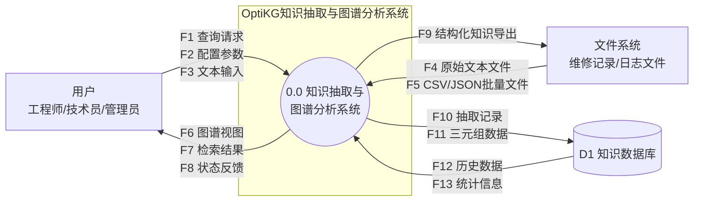
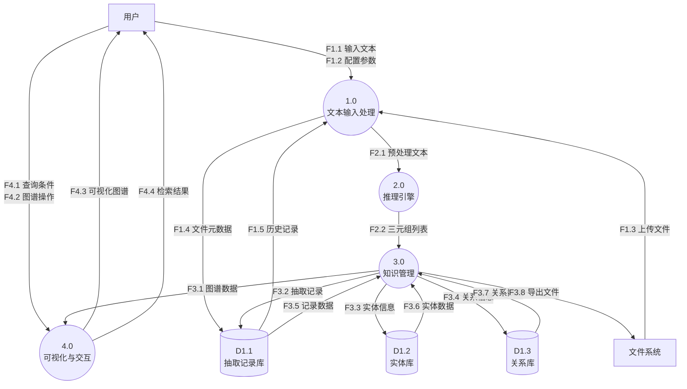
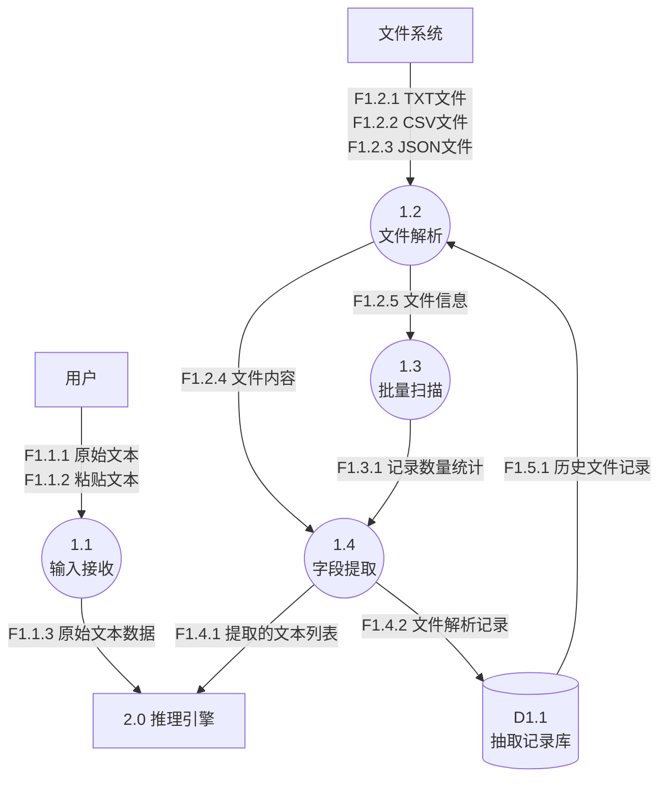
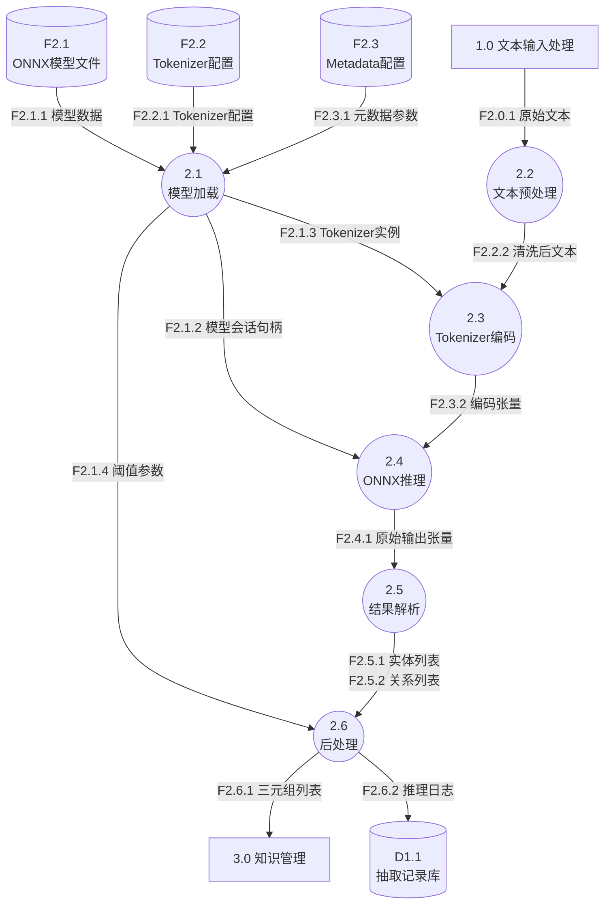
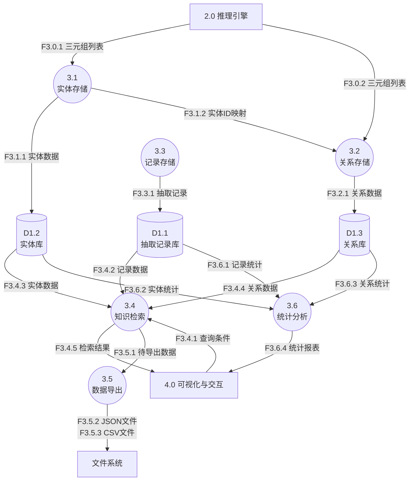
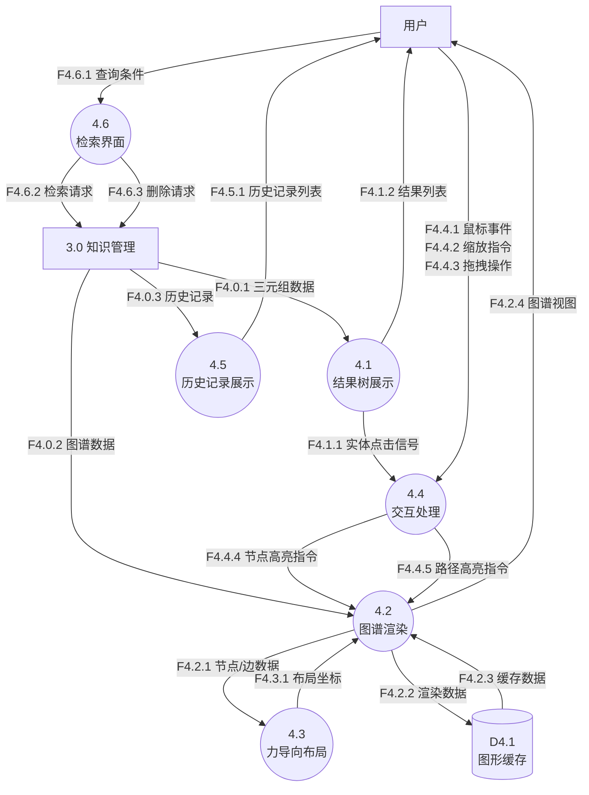
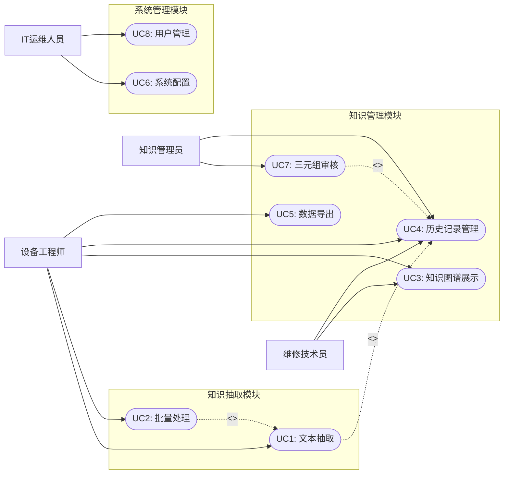
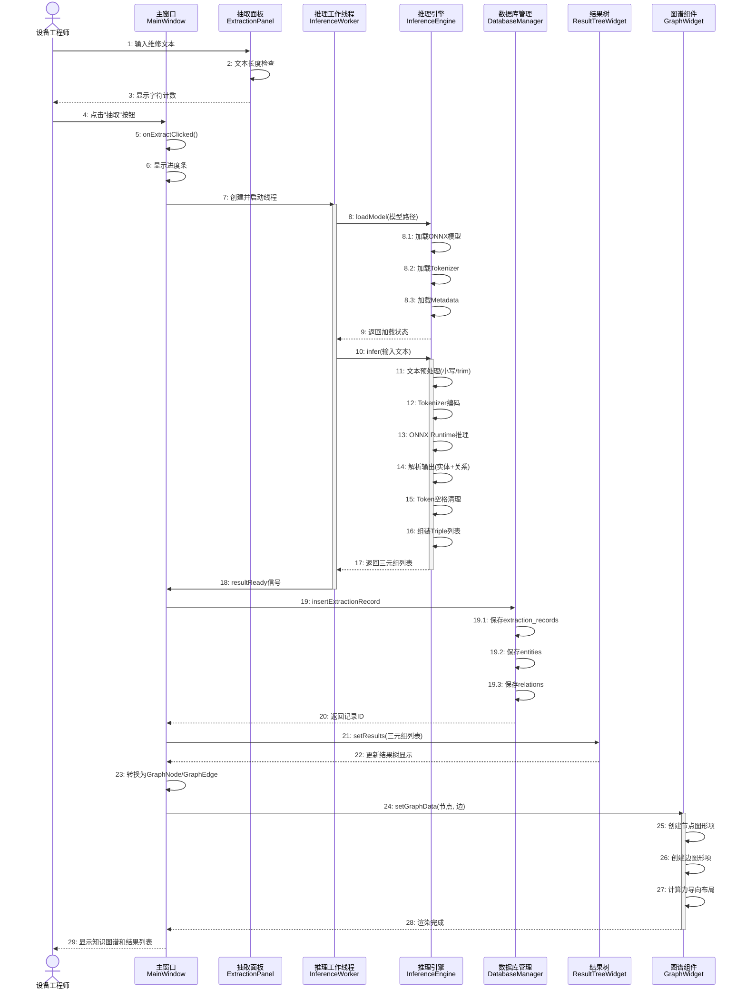
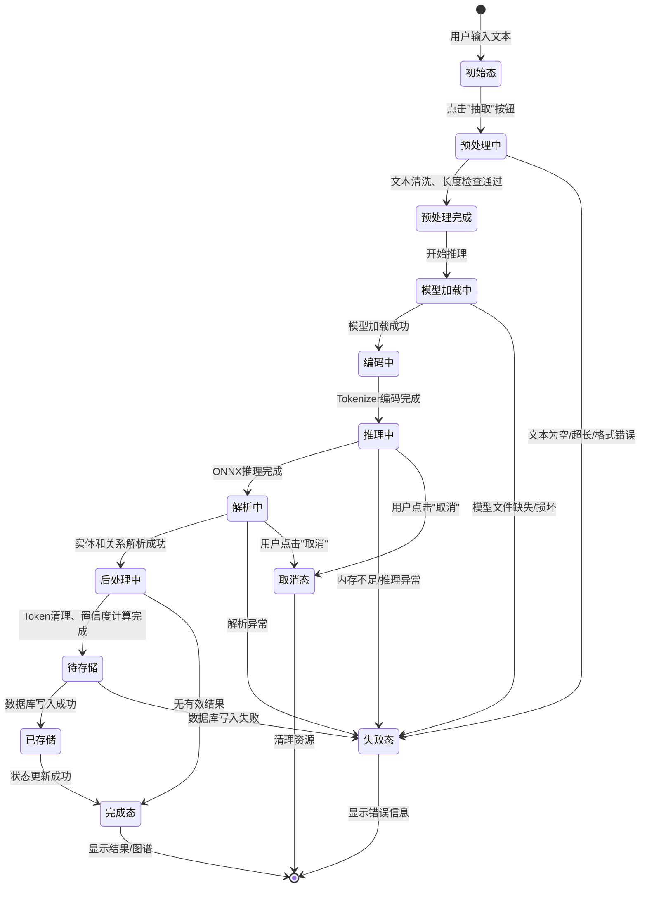

SourceURL:file:///home/arch/Downloads/软件工程大作业.docx

# 第3章 需求分析

## 3.1 用户顶级需求描述

### 3.1.1 产品需求简要描述

OptiKG是一款面向工业领域的离线知识抽取与图谱分析系统，旨在帮助工业企业从维修日志、故障报告、技术手册等非结构化文本中，自动提取结构化的知识三元组（部件-故障-工具-组成），并通过可视化图谱辅助故障诊断与知识管理。

**核心功能需求：**

- **文本知识抽取**：支持单条文本实时抽取和批量文件（JSON/CSV）处理，输出带置信度评分的实体关系三元组。
- **知识图谱可视化**：以交互式力导向图展示实体间关联，支持节点拖拽、缩放、高亮聚焦等操作。
- **知识检索与导出**：按关键词、实体类型等条件检索历史抽取结果，支持导出为JSON/CSV格式。
- **系统配置与管理**：允许管理员调整置信度阈值、文本分块策略等参数，并管理用户权限与模型版本。

### 3.1.2 用户单位组织结构

以某汽车零部件制造企业设备管理部门为例：

```
┌─────────────────────────────────────────┐
│              部门主管                    │
│         （审批、监控、决策）              │
└─────────────────┬───────────────────────┘
                  │
    ┌─────────────┼─────────────┐
    │             │             │
    ▼             ▼             ▼
┌────────┐  ┌────────────┐  ┌──────────┐
│知识管理者│  │ 设备工程师  │  │IT运维人员 │
│(审核维护)│  │(核心使用者) │  │(部署管理) │
└────┬───┘  └─────┬──────┘  └──────────┘
     │            │
     │       ┌────┴────┐
     │       │         │
     ▼       ▼         ▼
  维修技术员  维修技术员  维修技术员
  (现场查询)  (现场查询)  (现场查询)
```

**各角色主要职责如下：**

| 角色 | 主要职责 |
|------|----------|
| 部门主管 | 审批知识管理方案，监控系统使用效果，决策知识库建设方向 |
| 知识管理者 | 审核抽取的三元组，保证知识质量，维护知识库，修正错误关系 |
| 设备工程师 | 核心用户，负责知识检索、录入、图谱查看及故障分析 |
| IT运维人员 | 负责系统部署、数据备份、权限管理、模型更新 |
| 维修技术员 | 查询故障处理方法和工具，辅助现场维修决策 |

## 3.2 基于结构化方法的需求分析

### 3.2.1 顶层DFD图（0层）

顶层数据流图描述OptiKG系统与外部实体之间的整体数据交互关系，将系统视为一个整体加工。



**顶层DFD数据流说明：**

| 数据流编号 | 数据流名称 | 流向 | 数据内容描述 |
|------------|------------|------|--------------|
| F1 | 查询请求 | 用户→系统 | 关键词、实体类型、时间范围等检索条件 |
| F2 | 配置参数 | 用户→系统 | 置信度阈值、分块大小、模型选择等 |
| F3 | 文本输入 | 用户→系统 | 维修日志文本、故障描述文本（≤5000字符） |
| F4 | 原始文本文件 | 文件系统→系统 | TXT格式的维修记录、故障报告 |
| F5 | 批量数据文件 | 文件系统→系统 | CSV/JSON格式的批量维修数据 |
| F6 | 图谱视图 | 系统→用户 | 可视化知识图谱、节点关系图 |
| F7 | 检索结果 | 系统→用户 | 匹配的三元组列表、实体信息 |
| F8 | 状态反馈 | 系统→用户 | 处理进度、错误提示、成功确认 |
| F9 | 结构化知识导出 | 系统→文件系统 | 导出的JSON/CSV格式知识文件 |
| F10 | 抽取记录 | 系统→D1 | 抽取时间、源文本、处理结果元数据 |
| F11 | 三元组数据 | 系统→D1 | 头实体、关系、尾实体、置信度 |
| F12 | 历史数据 | D1→系统 | 历史抽取记录、已存储三元组 |
| F13 | 统计信息 | D1→系统 | 记录数量、实体统计、关系统计 |

**外部实体说明：**
- **E1 用户**：系统使用者，包括设备工程师、维修技术员、知识管理员、IT运维人员
- **E2 文件系统**：存储维修日志、故障报告、CSV/JSON批量数据的文件系统

**数据存储说明：**
- **D1 知识数据库**：SQLite数据库，存储抽取记录、实体、关系三元组

### 3.2.2 一层DFD图

一层数据流图将顶层加工分解为四个主要加工，展示系统内部的功能模块划分及数据流动关系。



**一层DFD加工说明：**

| 加工编号 | 加工名称 | 功能描述 | 对应代码类 |
|----------|----------|----------|------------|
| 1.0 | 文本输入处理 | 接收用户输入，解析TXT/CSV/JSON文件，文本长度检查 | ExtractionPanel, BatchProcessor |
| 2.0 | 推理引擎 | 加载ONNX模型，执行命名实体识别和关系抽取，后处理 | InferenceEngine |
| 3.0 | 知识管理 | 存储、检索、管理抽取的知识三元组，执行数据导出 | DatabaseManager |
| 4.0 | 可视化与交互 | 知识图谱渲染，用户交互处理，检索结果展示 | GraphWidget, HistoryPanel, ResultTreeWidget |

**一层DFD数据存储说明：**

| 数据存储编号 | 数据存储名称 | 存储内容 | 对应数据库表 |
|--------------|--------------|----------|--------------|
| D1.1 | 抽取记录库 | 抽取任务记录、处理时间、源文件信息 | extraction_records |
| D1.2 | 实体库 | 实体名称、类型、位置、置信度 | entities |
| D1.3 | 关系库 | 关系类型、主体ID、客体ID、置信度 | relations |

### 3.2.3 二层DFD图

二层DFD对每个一层加工进行进一步分解，详细展示内部处理逻辑。

#### 3.2.3.1 二层DFD - 文本输入处理（加工1.0）



**加工1.0分解说明：**

| 子加工编号 | 子加工名称 | 功能描述 | 对应代码方法 |
|------------|------------|----------|--------------|
| 1.1 | 输入接收 | 接收用户直接输入或粘贴的文本，进行长度检查（≤5000字符） | ExtractionPanel::text() |
| 1.2 | 文件解析 | 解析TXT、CSV、JSON文件，处理编码格式（UTF-8/GBK） | BatchProcessor::processJsonFile, processCsvFile |
| 1.3 | 批量扫描 | 预处理扫描获取总记录数，用于进度计算 | BatchProcessor::scanJsonFile, scanCsvFile |
| 1.4 | 字段提取 | 从JSON/CSV中提取指定字段的文本内容 | BatchProcessor字段映射配置 |

#### 3.2.3.2 二层DFD - 推理引擎（加工2.0）



**加工2.0分解说明：**

| 子加工编号 | 子加工名称 | 功能描述 | 对应代码方法 |
|------------|------------|----------|--------------|
| 2.1 | 模型加载 | 加载ONNX模型、Tokenizer配置、Metadata元数据（max_len, threshold, id2predicate） | InferenceEngine::loadModel, loadTokenizer, loadMetadata |
| 2.2 | 文本预处理 | 文本转小写、trim、JSON输入解析 | InferenceEngine::runInference (前段处理) |
| 2.3 | Tokenizer编码 | 使用Tokenizer编码为input_ids和attention_mask，智能截断处理 | tokenizer_->Encode, 构建inputIdsTensor/attentionMaskTensor |
| 2.4 | ONNX推理 | 调用ONNX Runtime执行模型推理 | session_->Run |
| 2.5 | 结果解析 | 解析模型输出张量，提取实体span和关系span | 解析entLogits, relHLogits, relTLogits |
| 2.6 | 后处理 | Token空格清理、置信度计算、三元组组装 | cleanTokenSpaces, 组装Triple |

**注**：长文本处理（inferLongText）在代码中是单独的方法，实现分块处理和智能去重，但在DFD中作为加工2.0的扩展处理流程。

#### 3.2.3.3 二层DFD - 知识管理（加工3.0）



**加工3.0分解说明：**

| 子加工编号 | 子加工名称 | 功能描述 | 对应代码方法 |
|------------|------------|----------|--------------|
| 3.1 | 实体存储 | 保存实体名称、类型、位置、置信度到entities表 | DatabaseManager::saveTriples (实体部分) |
| 3.2 | 关系存储 | 保存关系到relations表，包含主体ID、客体ID、关系类型、置信度 | DatabaseManager::saveTriples (关系部分) |
| 3.3 | 记录存储 | 保存抽取记录到extraction_records表 | DatabaseManager::insertExtractionRecord |
| 3.4 | 知识检索 | 支持按关键词、时间范围、实体类型检索 | DatabaseManager::searchExtractionRecords |
| 3.5 | 数据导出 | 将检索结果导出为JSON或CSV格式 | MainWindow::onExportJsonClicked, onExportCsvClicked |
| 3.6 | 统计分析 | 统计记录数、实体数、关系数、平均置信度 | DatabaseManager::getRecordCount, getEntityCount, getRelationCount, getAverageConfidence |

#### 3.2.3.4 二层DFD - 可视化与交互（加工4.0）



**加工4.0分解说明：**

| 子加工编号 | 子加工名称 | 功能描述 | 对应代码类/方法 |
|------------|------------|----------|-----------------|
| 4.1 | 结果树展示 | 以树形结构展示抽取的三元组结果 | ResultTreeWidget |
| 4.2 | 图谱渲染 | 使用QGraphicsView渲染节点和边 | GraphWidget::setGraphData, createNode, createEdge |
| 4.3 | 力导向布局 | 计算节点位置（Fruchterman-Reingold算法） | GraphWidget::computeForceDirectedLayout |
| 4.4 | 交互处理 | 处理鼠标点击、拖拽、滚轮缩放、节点高亮 | GraphWidget鼠标事件处理 |
| 4.5 | 历史记录展示 | 展示历史抽取记录表格 | HistoryPanel |
| 4.6 | 检索界面 | 提供搜索框、筛选条件、删除操作 | HistoryPanel::onSearch, onBatchDelete |

### 3.2.4 DFD数据字典

**数据元素定义：**

| 数据元素 | 类型 | 长度 | 描述 |
|----------|------|------|------|
| 记录ID | 整数 | 8字节 | 抽取记录唯一标识符（自增） |
| 文本内容 | 字符串 | ≤5000字符 | 输入的维修日志或故障描述 |
| 实体名称 | 字符串 | ≤100字符 | 部件、故障、工具等实体名称 |
| 实体类型 | 枚举 | 4字节 | 0=Component(部件), 1=Fault(故障), 2=Tool(工具), 3=Composition(组成) |
| 关系类型 | 枚举 | 4字节 | 0=ComponentFault, 1=PerformanceFault, 2=DetectionTool, 3=CompositionRel |
| 关系名称 | 字符串 | ≤50字符 | 实体间关系描述文本 |
| 置信度 | 浮点数 | 4字节 | 模型预测置信度，计算方式：实体置信度×关系置信度 |
| 时间戳 | 日期时间 | 8字节 | 记录创建时间（ISO格式） |
| 处理时间 | 整数 | 4字节 | 推理处理耗时（毫秒） |
| 文件路径 | 字符串 | ≤260字符 | 文件在系统中的存储路径 |

**数据流详细定义：**

| 数据流 | 组成 | 频率 | 备注 |
|--------|------|------|------|
| 预处理文本 | 文本内容 + 配置参数 | 每次抽取 | 文本长度≤5000字符 |
| 三元组列表 | [Triple结构体列表] | 每次推理 | 包含subject, object, relation, confidence |
| 编码张量 | input_ids + attention_mask | 每次推理 | Tensor格式，shape=[1, max_seq_length] |
| 图谱数据 | GraphNode列表 + GraphEdge列表 | 每次展示 | 用于可视化渲染 |
| 查询条件 | 关键词 + 时间范围 + 实体类型 | 每次检索 | 支持组合条件筛选 |

**数据存储详细定义：**

| 数据存储 | 表名 | 关键字段 | 索引 |
|----------|------|----------|------|
| D1.1 抽取记录库 | extraction_records | id, content, created_at, process_time_ms, avg_confidence, entity_count, relation_count | created_at, avg_confidence |
| D1.2 实体库 | entities | id, record_id, name, type, start_pos, end_pos, confidence | record_id, type |
| D1.3 关系库 | relations | id, record_id, subject_id, object_id, relation, relation_type, confidence | record_id, relation |

## 3.3 面向对象方法的需求分析

### 3.3.1 用户角色用例图



**用例详细说明：**

| 用例编号 | 用例名称 | 参与者 | 前置条件 | 后置条件 | 基本事件流 |
|----------|----------|--------|----------|----------|------------|
| UC1 | 文本抽取 | 设备工程师 | 系统已启动，模型已加载 | 生成知识图谱，保存到历史记录 | 1.输入文本→2.点击抽取→3.查看结果→4.保存记录 |
| UC2 | 批量处理 | 设备工程师 | 系统已启动，批量文件已准备 | 所有文件处理完成，生成批量报告 | 1.选择文件→2.配置字段映射→3.执行批量处理→4.查看报告 |
| UC3 | 知识图谱展示 | 所有用户 | 存在已抽取的三元组数据 | 用户可交互探索图谱 | 1.选择记录→2.生成图谱→3.交互浏览→4.可选导出图片 |
| UC4 | 历史记录管理 | 所有用户 | 数据库中存在历史记录 | 显示或更新记录列表 | 1.进入历史页面→2.检索/筛选→3.查看详情→4.删除/导出 |
| UC5 | 数据导出 | 所有用户 | 存在可导出的数据 | 生成JSON/CSV文件 | 1.选择记录→2.选择格式→3.指定路径→4.执行导出 |
| UC6 | 系统配置 | IT运维人员 | 具有管理员权限 | 配置参数生效 | 1.进入设置→2.修改参数→3.保存配置→4.验证生效 |
| UC7 | 三元组审核 | 知识管理员 | 存在待审核的抽取记录 | 审核状态更新 | 1.查看待审核→2.验证三元组→3.修正错误→4.确认审核 |
| UC8 | 用户管理 | IT运维人员 | 具有管理员权限 | 用户信息更新 | 1.查看用户列表→2.新增/编辑/删除→3.分配角色→4.保存 |

### 3.3.2 典型业务的顺序图

**场景：设备工程师上传维修日志并查看抽取结果**



**消息流说明：**

| 序号 | 消息 | 发送者 | 接收者 | 消息内容描述 |
|------|------|--------|--------|--------------|
| 1-4 | 用户输入与触发 | 用户 | MW | 输入文本并点击抽取按钮 |
| 5-7 | 启动推理流程 | MW | IW | 创建InferenceWorker线程，传递文本和参数 |
| 8-9 | 模型加载 | IW | IE | 加载ONNX模型、Tokenizer、Metadata配置 |
| 10-17 | 模型推理执行 | IW | IE | 文本预处理→编码→推理→解析→组装三元组 |
| 18-20 | 数据持久化 | MW | DB | 保存抽取记录、实体、关系到SQLite数据库 |
| 21-22 | 结果树更新 | MW | RT | 在结果树中展示三元组列表 |
| 23-28 | 图谱渲染 | MW | GW | 生成图形项，计算力导向布局，渲染显示 |
| 29 | 结果展示 | MW | 用户 | 在界面上展示最终成果 |

### 3.3.3 知识三元组状态图



**状态说明：**

| 状态 | 描述 | 触发条件 | 可能转换 |
|------|------|----------|----------|
| 初始态 | 等待用户输入 | 系统启动完成 | 预处理中 |
| 预处理中 | 执行文本清洗和验证 | 用户点击抽取 | 预处理完成/失败态 |
| 预处理完成 | 文本准备就绪 | 预处理成功 | 模型加载中 |
| 模型加载中 | 加载ONNX模型和Tokenizer | 预处理完成 | 编码中/失败态 |
| 编码中 | Tokenizer编码为input_ids | 模型加载成功 | 推理中 |
| 推理中 | 执行ONNX Runtime推理 | 编码完成 | 解析中/失败态/取消态 |
| 解析中 | 解析模型输出张量 | 推理完成 | 后处理中/失败态/取消态 |
| 后处理中 | Token空格清理、置信度计算 | 解析成功 | 待存储/完成态 |
| 待存储 | 等待数据库写入 | 后处理完成 | 已存储/失败态 |
| 已存储 | 数据持久化完成 | 存储成功 | 完成态 |
| 完成态 | 处理流程结束 | 存储完成或无结果 | 结束 |
| 失败态 | 处理过程出错 | 各阶段异常 | 结束 |
| 取消态 | 用户主动取消 | 用户点击取消 | 结束 |

## 3.4 功能性需求分析

### 3.4.1 功能需求列表

| 编号 | 功能模块 | 功能描述 | 优先级 | 实现状态 | 对应代码 |
|------|----------|----------|--------|----------|----------|
| FR-01 | 文本输入 | 支持直接文本输入（≤5000字符），实时字符计数 | 高 | ✅ 已实现 | ExtractionPanel |
| FR-02 | 文件上传 | 支持TXT/CSV/JSON格式，单文件≤10MB，编码自动识别 | 高 | ✅ 已实现 | BatchProcessor |
| FR-03 | 批量处理 | 支持多文件批量导入，后台线程处理，进度实时显示 | 高 | ✅ 已实现 | BatchProcessor |
| FR-04 | 知识抽取 | 抽取部件、故障、工具、组成四类实体，准确率≥85% | 高 | ✅ 已实现 | InferenceEngine::runInference |
| FR-05 | 长文本处理 | 支持长文档分块处理（默认500字符/块，重叠100字符） | 高 | ✅ 已实现 | InferenceEngine::inferLongText |
| FR-06 | 知识图谱展示 | 力导向图布局，支持缩放、拖拽、节点详情、高亮聚焦 | 高 | ✅ 已实现 | GraphWidget |
| FR-07 | 知识检索 | 按部件/故障/工具关键词检索，支持时间范围、实体类型筛选 | 高 | ✅ 已实现 | DatabaseManager::searchExtractionRecords |
| FR-08 | 数据导出 | 导出CSV/JSON格式，支持单个记录或批量导出 | 高 | ✅ 已实现 | MainWindow::onExportJson/CsvClicked |
| FR-09 | 历史记录管理 | 查看、搜索、删除历史抽取记录，显示处理时间和置信度 | 中 | ✅ 已实现 | HistoryPanel |
| FR-10 | 置信度过滤 | 动态调整置信度阈值（默认-10），过滤低质量抽取结果 | 中 | ✅ 已实现 | InferenceEngine::setThreshold |
| FR-11 | 模型管理 | ONNX模型热加载，Tokenizer配置，metadata参数解析 | 中 | ✅ 已实现 | InferenceEngine::loadModel |
| FR-12 | 数据库管理 | SQLite数据存储，支持增删改查、批量操作、事务处理 | 中 | ✅ 已实现 | DatabaseManager |
| FR-13 | 图谱交互 | 节点点击高亮、关联路径追踪、视图缩放自适应 | 中 | ✅ 已实现 | GraphWidget鼠标事件 |
| FR-14 | 系统配置 | 置信度阈值、分块参数、模型路径配置 | 低 | ✅ 已实现 | ConfigManager, SettingsDialog |
| FR-15 | 日志系统 | 操作日志记录，错误追踪，性能监控 | 低 | ✅ 已实现 | Logger |

### 3.4.2 功能实现详细说明

**FR-01 ~ FR-03 输入处理功能：**
- 通过`ExtractionPanel`类实现文本输入界面，支持5000字符限制
- 通过`BatchProcessor`类实现批量文件处理，支持多线程并行处理
- 支持UTF-8/GBK编码自动检测和转换

**FR-04 ~ FR-05 知识抽取功能：**
- 通过`InferenceEngine`类实现核心推理功能
- 支持滑动窗口分块机制，智能句子边界分割
- 实体类型：Component(部件), Fault(故障), Tool(工具), Composition(组成)
- 关系类型：ComponentFault, PerformanceFault, DetectionTool, CompositionRel

**FR-06 知识图谱展示功能：**
- 通过`GraphWidget`类实现图谱渲染
- 采用Fruchterman-Reingold力导向布局算法
- 支持节点拖拽、滚轮缩放、右键菜单、节点高亮、路径追踪

**FR-07 ~ FR-09 知识管理功能：**
- 通过`HistoryPanel`类实现历史记录管理界面
- 通过`DatabaseManager`类实现数据持久化
- 支持多条件组合检索（关键词、时间范围、实体类型）

## 3.5 非功能性需求分析

### 3.5.1 性能需求

| 编号 | 需求项 | 需求描述 | 目标值 | 验证方法 |
|------|--------|----------|--------|----------|
| NFR-01 | 推理响应时间 | 单条文本（500字内）抽取完成时间 | ≤2秒 | 性能测试 |
| NFR-02 | 图谱加载时间 | 100个节点图谱渲染完成时间 | ≤3秒 | 性能测试 |
| NFR-03 | 批量处理速度 | 处理100条记录所需时间 | ≤5分钟 | 性能测试 |
| NFR-04 | 并发能力 | 支持的同时处理任务数 | 1个（单用户） | 设计约束 |
| NFR-05 | 内存占用峰值 | 系统运行时的最大内存使用 | ≤1.5GB | 内存监控 |
| NFR-06 | 启动时间 | 双击到主界面可用时间 | ≤3秒 | 启动测试 |
| NFR-07 | 数据库响应 | 单次查询响应时间 | ≤500ms | 性能测试 |

### 3.5.2 可靠性需求

| 编号 | 需求项 | 需求描述 | 目标值 |
|------|--------|----------|--------|
| NFR-08 | 可用性 | 系统正常运行时间占比 | ≥99.9%（离线应用） |
| NFR-09 | 故障恢复 | 异常崩溃后数据完整性 | 已保存数据不丢失 |
| NFR-10 | 错误处理 | 异常操作的优雅处理 | 不崩溃，有友好提示 |
| NFR-11 | 数据一致性 | 数据库事务完整性 | ACID保证 |

### 3.5.3 安全性需求

| 编号 | 需求项 | 需求描述 | 实现方式 |
|------|--------|----------|----------|
| NFR-12 | 数据隔离 | 数据不出内网 | 完全离线运行 |
| NFR-13 | 存储安全 | 本地数据保护 | SQLite本地存储 |
| NFR-14 | 访问控制 | 用户权限管理 | 角色基础的访问控制 |
| NFR-15 | 审计追踪 | 操作日志记录 | 文件日志系统 |

### 3.5.4 可用性与易用性需求

| 编号 | 需求项 | 需求描述 | 目标值 |
|------|--------|----------|--------|
| NFR-16 | 操作步骤 | 核心功能操作步骤数 | ≤3步 |
| NFR-17 | 学习曲线 | 无编程基础用户上手时间 | ≤30分钟 |
| NFR-18 | 界面响应 | UI操作响应时间 | ≤100ms |
| NFR-19 | 反馈机制 | 操作结果反馈 | 实时状态显示 |
| NFR-20 | 帮助系统 | 内置帮助文档 | 主要功能有说明 |

### 3.5.5 可维护性与可扩展性需求

| 编号 | 需求项 | 需求描述 | 实现方式 |
|------|--------|----------|----------|
| NFR-21 | 模块化设计 | 功能模块间耦合度 | 低耦合高内聚 |
| NFR-22 | 模型热替换 | 不重启更新模型 | 动态加载ONNX模型 |
| NFR-23 | 配置灵活性 | 参数可配置程度 | 阈值、参数可调 |
| NFR-24 | 日志记录 | 运行日志详细程度 | 分级日志系统 |
| NFR-25 | 代码可读性 | 代码注释覆盖率 | 关键代码有注释 |

### 3.5.6 兼容性与可移植性需求

| 编号 | 需求项 | 需求描述 | 目标值 |
|------|--------|----------|--------|
| NFR-26 | 操作系统 | 支持的操作系统 | Windows 10/11 |
| NFR-27 | 架构支持 | CPU架构支持 | x64 |
| NFR-28 | 数据格式 | 支持的文件格式 | TXT/CSV/JSON |
| NFR-29 | 编码支持 | 文本编码支持 | UTF-8/GBK |
| NFR-30 | 部署方式 | 软件分发方式 | 绿色免安装 |

### 3.5.7 非功能性需求验证矩阵

| 需求类别 | 验证方法 | 验收标准 |
|----------|----------|----------|
| 性能需求 | 压力测试、性能测试 | 达到响应时间和资源占用指标 |
| 可靠性需求 | 异常测试、长时间运行测试 | 无崩溃，数据完整 |
| 安全性需求 | 代码审计、渗透测试 | 无数据泄露风险 |
| 可用性需求 | 用户测试、专家评审 | 用户体验良好 |
| 可维护性需求 | 代码审查、架构评审 | 符合设计规范 |
| 兼容性需求 | 环境测试、兼容性测试 | 在目标平台正常运行 |

