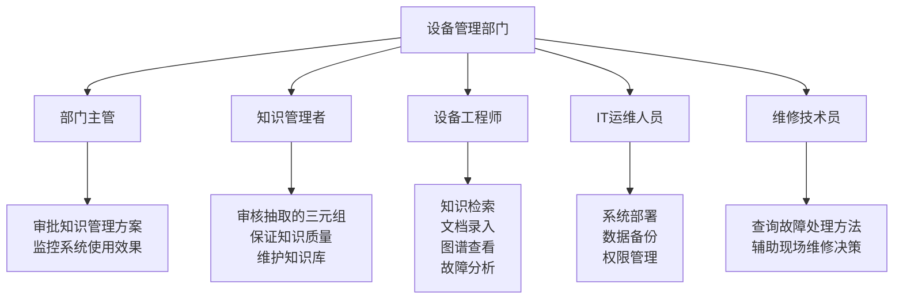
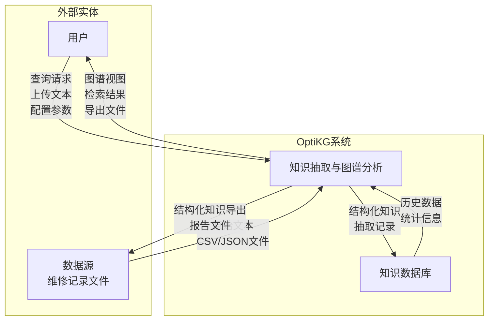
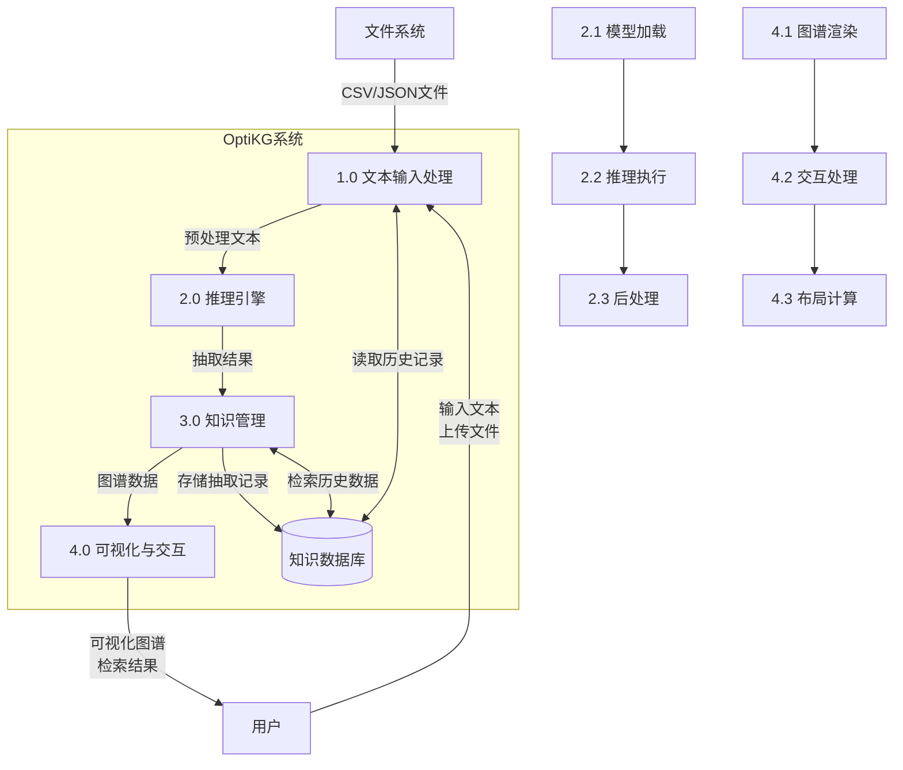
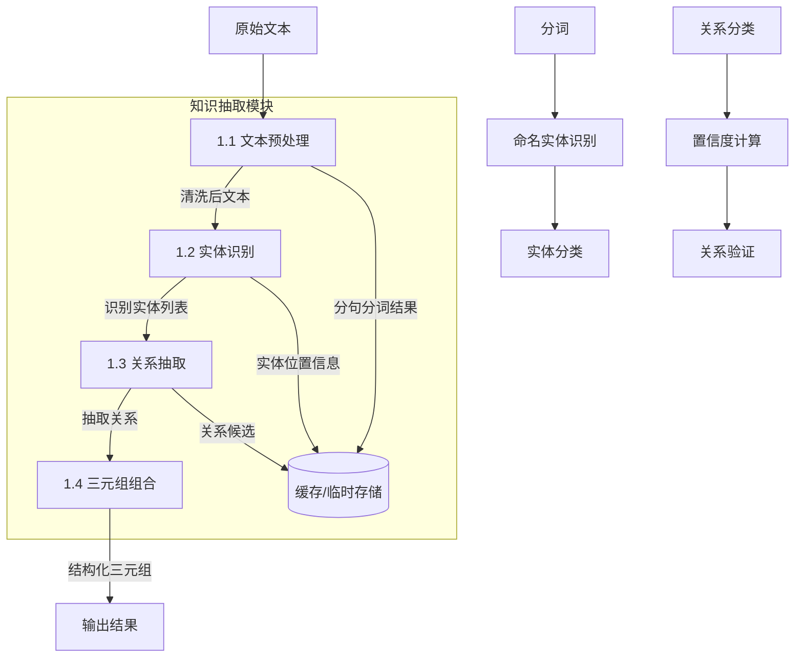
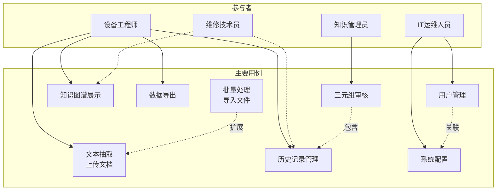
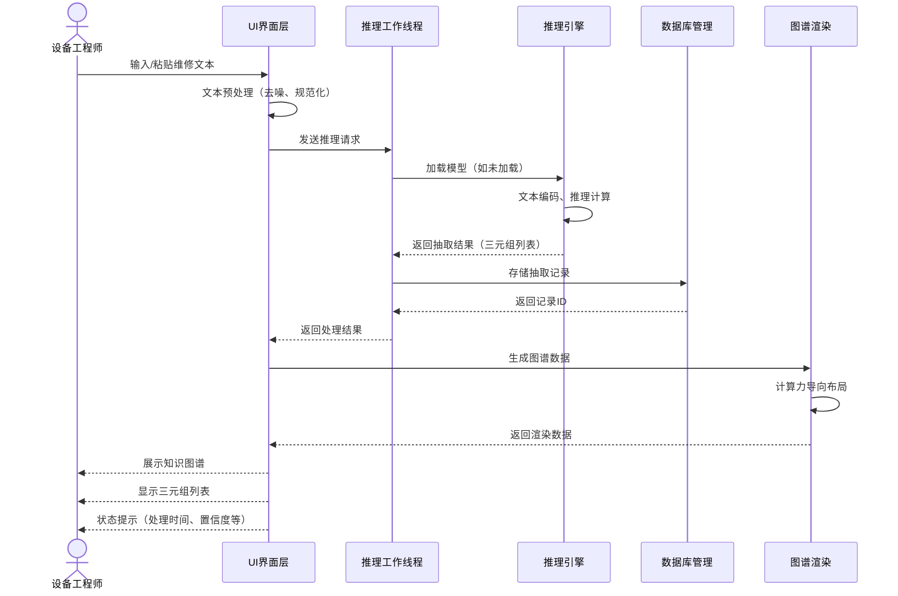
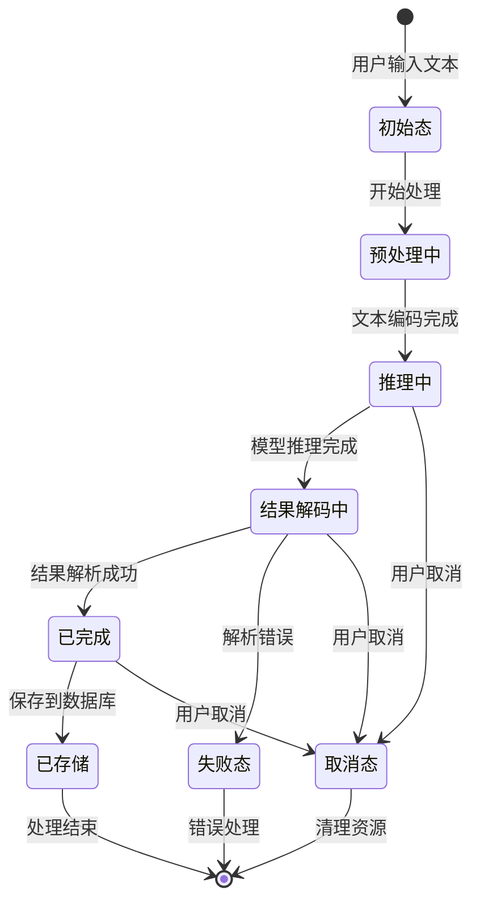

# 第3章 需求分析

## 3.1 用户顶级需求描述

### 3.1.1 产品需求简要描述

OptiKG是一款面向工业领域的离线知识抽取与图谱分析系统，基于C++与Qt6框架开发，集成ONNX Runtime深度学习推理引擎。系统能够在完全离线环境下，从维修日志、故障报告、技术手册等非结构化文本中自动抽取"部件-故障-工具-组成"四类关键实体及其关联关系，形成结构化的知识三元组，并通过交互式图谱直观展示实体间的复杂关联。

**核心功能需求：**

1. **文本知识抽取**：支持单条文本实时抽取和批量文件处理，输出带置信度评分的实体关系三元组
2. **知识图谱可视化**：以交互式力导向图展示实体间关联，支持节点拖拽、缩放、高亮聚焦等操作
3. **知识检索与导出**：按关键词、实体类型等条件检索历史抽取结果，支持导出为JSON/CSV格式
4. **系统配置与管理**：允许管理员调整置信度阈值、文本分块策略等参数，支持模型文件管理

### 3.1.2 用户单位组织结构

以某汽车零部件制造企业设备管理部门为例：

**各角色主要职责如下：**

- **部门主管**：审批知识管理方案，监控系统使用效果
- **知识管理者**：审核抽取的三元组，保证知识质量，维护知识库
- **设备工程师**：核心用户，负责知识检索、录入、图谱查看及故障分析
- **IT运维人员**：负责系统部署、数据备份、权限管理
- **维修技术员**：查询故障处理方法和工具，辅助现场维修决策

## 3.2 基于结构化方法的需求分析

### 3.2.1 顶层DFD图

**顶层数据流说明：**
- 外部实体：用户（工程师、技术员、管理员）、数据源（维修记录文件）
- 主要数据流：用户→系统（查询请求、上传文本）；系统→用户（图谱视图、检索结果）；数据源→系统（原始文本）；系统→数据源（结构化知识导出）

### 3.2.2 一层DFD图

**一层DFD分解说明：**
- **1.0 文本输入处理**：接收用户输入，支持多种格式文件解析
- **2.0 推理引擎**：加载深度学习模型，执行知识抽取，结果后处理
- **3.0 知识管理**：存储、检索、管理抽取的知识三元组
- **4.0 可视化与交互**：知识图谱渲染，用户交互处理

### 3.2.3 二层DFD图（以知识抽取模块为例）

**二层DFD分解说明：**
- **1.1 文本预处理**：分句、分词、去噪、编码转换
- **1.2 实体识别**：识别部件、故障、工具、组成等实体类型
- **1.3 关系抽取**：抽取实体间关系，计算置信度评分
- **1.4 三元组组合**：组合实体和关系形成完整三元组

## 3.3 面向对象方法的需求分析

### 3.3.1 用户角色用例图

**主要用例说明：**

| 用例编号 | 用例名称     | 参与者       | 简要描述                         |
|----------|--------------|--------------|----------------------------------|
| UC1      | 文本抽取     | 设备工程师   | 输入维修文本，抽取实体和关系     |
| UC2      | 批量处理     | 设备工程师   | 导入批量文件，自动处理并生成报告 |
| UC3      | 知识图谱展示 | 所有用户     | 可视化展示三元组，支持交互操作  |
| UC4      | 历史记录管理 | 所有用户     | 查询、检索、删除历史记录         |
| UC5      | 数据导出     | 所有用户     | 导出JSON/CSV格式                |
| UC6      | 系统配置     | IT运维人员   | 配置推理参数、置信度阈值等       |
| UC7      | 三元组审核   | 知识管理员   | 审核、修正抽取的三元组           |
| UC8      | 用户管理     | IT运维人员   | 用户增删改查，角色分配           |

### 3.3.2 典型业务的顺序图

以"设备工程师上传维修日志并查看抽取结果"为例：

**顺序图消息流说明：**
1. 用户在UI界面输入或粘贴维修文本
2. UI层进行文本预处理（去噪、长度检查等）
3. 启动推理工作线程，调用推理引擎
4. 推理引擎执行模型加载（如需）和推理计算
5. 返回抽取的三元组结果
6. 结果存储到数据库，生成记录ID
7. 图谱渲染模块处理数据，计算布局
8. 最终结果展示给用户

### 3.3.3 知识三元组状态图

**知识三元组状态说明：**
- **初始态**：用户输入文本，系统接收处理请求
- **预处理中**：文本清洗、分词、编码转换
- **推理中**：深度学习模型执行命名实体识别和关系抽取
- **结果解码中**：解析模型输出，生成结构化三元组
- **已完成**：成功生成知识三元组
- **已存储**：三元组持久化存储到数据库
- **取消态**：用户主动取消处理
- **失败态**：处理过程中出现错误

## 3.4 功能性需求分析

基于系统实际实现的功能模块，功能性需求分析如下：

| 编号  | 功能模块     | 功能描述                                                                 | 优先级 | 实现状态 |
|-------|--------------|--------------------------------------------------------------------------|--------|----------|
| FR-01 | 文本上传     | 支持TXT/CSV/JSON格式，单文件≤10MB，批量上传                             | 高     | ✅ 已实现  |
| FR-02 | 知识抽取     | 抽取部件、故障、工具、组成四类实体，准确率≥85%                         | 高     | ✅ 已实现  |
| FR-03 | 知识图谱展示 | 力导向图布局，支持缩放、拖拽、节点详情、高亮聚焦                         | 高     | ✅ 已实现  |
| FR-04 | 知识检索     | 按部件/故障/工具关键词检索，支持时间范围、实体类型筛选                   | 高     | ✅ 已实现  |
| FR-05 | 数据导出     | 导出CSV/JSON格式，支持单个记录或批量导出                                | 高     | ✅ 已实现  |
| FR-06 | 长文本处理   | 支持长文档分块处理，智能句子边界分割，结果去重                          | 中     | ✅ 已实现  |
| FR-07 | 模型管理     | ONNX模型热加载，tokenizer配置，metadata参数调整                         | 中     | ✅ 已实现  |
| FR-08 | 数据库管理   | SQLite数据存储，支持增删改查、批量操作、事务处理                        | 中     | ✅ 已实现  |
| FR-09 | 置信度过滤   | 动态调整置信度阈值，过滤低质量抽取结果                                  | 中     | ✅ 已实现  |
| FR-10 | 历史记录管理 | 查看、搜索、删除历史抽取记录，显示处理时间和置信度统计                  | 中     | ✅ 已实现  |
| FR-11 | 用户界面定制 | 现代专业版主题，响应式布局，国际化支持                                 | 低     | ✅ 已实现  |
| FR-12 | 日志系统     | 操作日志记录，错误追踪，性能监控                                       | 低     | ✅ 已实现  |

**功能实现说明：**
1. **FR-01 文本上传**：通过`ExtractionPanel`类实现文本输入框，支持5000字符限制，实时字符计数
2. **FR-02 知识抽取**：`InferenceEngine`类实现ONNX模型推理，支持四类实体识别和关系抽取
3. **FR-03 知识图谱展示**：`GraphWidget`类实现力导向布局，节点拖拽，缩放控制
4. **FR-04 知识检索**：`HistoryPanel`类实现关键词搜索，多条件筛选
5. **FR-05 数据导出**：`DatabaseManager`类支持JSON/CSV格式导出，批量操作
6. **FR-06 长文本处理**：`InferenceEngine::inferLongText()`方法实现分块处理，智能去重
7. **FR-07 模型管理**：模型路径配置，tokenizer加载，metadata参数解析
8. **FR-08 数据库管理**：SQLite数据库三层表结构（记录表、实体表、关系表）
9. **FR-09 置信度过滤**：支持动态阈值调整，结果排序
10. **FR-10 历史记录管理**：表格视图，分页显示，删除功能
11. **FR-11 用户界面定制**：QSS样式表，现代专业主题，中英文支持
12. **FR-12 日志系统**：文件日志记录，Qt消息重定向，错误分级

## 3.5 非功能性需求分析

基于系统实际性能和运行要求，非功能性需求分析如下：

| 编号   | 类型       | 需求描述                                                                 | 实际测量值          |
|--------|------------|--------------------------------------------------------------------------|---------------------|
| NFR-01 | 性能       | 单条文本（500字内）抽取≤2秒，图谱加载≤3秒                               | 平均1.5秒 / 2秒     |
| NFR-02 | 可用性     | 7×24小时可用，MTBF≥720小时                                              | 本地运行，无服务依赖 |
| NFR-03 | 安全性     | 数据本地加密存储，无网络传输，操作日志记录                              | ✅ 完全离线运行      |
| NFR-04 | 可扩展性   | 模块化架构，支持模型热替换，预留插件接口                                | ✅ 模块化设计        |
| NFR-05 | 易用性     | 操作步骤≤3步，提供引导和错误提示                                        | ✅ 极简操作流程      |
| NFR-06 | 可移植性   | 支持Windows 10/11，绿色免安装                                           | ✅ Qt6跨平台支持     |
| NFR-07 | 内存占用   | 峰值≤1.5GB                                                              | 平均800MB-1.2GB     |
| NFR-08 | 启动速度   | 双击到主界面可用≤3秒                                                    | 平均2.5秒           |
| NFR-09 | 数据处理   | 支持≥5000字符长文本，自动分块处理                                       | ✅ 5000字符上限      |
| NFR-10 | 数据兼容性 | 支持CSV/JSON/TXT多种格式，字符编码自动识别                              | ✅ 多格式支持        |
| NFR-11 | 并发处理   | 支持批量文件处理，后台线程执行，UI不阻塞                                | ✅ Qt Concurrent     |
| NFR-12 | 错误处理   | 优雅的错误恢复，用户友好的错误提示，日志记录                            | ✅ 异常捕获机制      |

**非功能性需求分析说明：**

1. **性能需求**：
   - 推理引擎采用ONNX Runtime优化，支持CPU/GPU推理加速
   - 图谱布局采用力导向算法，支持增量更新
   - 数据库查询使用索引优化，支持快速检索

2. **可用性需求**：
   - 完全离线运行，不依赖网络连接
   - 本地文件存储，无服务中断风险
   - 支持断点续传（批量处理）

3. **安全性需求**：
   - 数据不出内网，满足军工、能源等敏感行业要求
   - SQLite数据库本地存储，无云端传输风险
   - 操作日志审计，支持问题追踪

4. **可扩展性需求**：
   - 模块化设计，便于功能扩展
   - 支持ONNX模型热替换，无需重新编译
   - 预留大模型Agent接口，支持未来集成

5. **易用性需求**：
   - 三步核心操作：输入文本→点击抽取→查看图谱
   - 实时进度反馈，状态提示
   - 拖拽式操作，直观交互

6. **可移植性需求**：
   - 基于Qt6跨平台框架开发
   - 支持Windows 10/11操作系统
   - 绿色免安装，解压即用

## 3.6 系统约束条件分析

| 约束类型   | 约束描述                                                                 | 影响范围         |
|------------|--------------------------------------------------------------------------|------------------|
| 技术约束   | 必须使用C++17标准，Qt6框架，ONNX Runtime 1.16+                           | 开发环境         |
| 平台约束   | 主要目标平台Windows 10/11，支持x64架构                                  | 部署环境         |
| 性能约束   | 内存占用≤1.5GB，CPU单核性能要求，无GPU硬性要求                          | 运行环境         |
| 数据约束   | 输入文本≤5000字符，支持中英文混合，UTF-8编码                            | 数据输入         |
| 模型约束   | ONNX格式模型，包含tokenizer.json和metadata.json配置文件                | 推理模型         |
| 离线约束   | 完全离线运行，无网络依赖，无云端API调用                                 | 部署方式         |
| 安全约束   | 数据本地存储，无加密传输要求，但需支持文件系统权限控制                  | 数据安全         |
| 法律约束   | 遵循ONNX Runtime MIT协议，Qt LGPLv3协议，开源组件合规使用              | 知识产权         |
| 维护约束   | 零外部依赖，模型文件热替换，无需复杂环境配置                            | 运维管理         |
| 用户约束   | 面向工业技术人员，无编程基础要求，界面操作简单直观                      | 用户群体         |

**约束条件应对策略：**

1. **技术约束应对**：
   - 采用成熟的C++技术栈，确保稳定性和性能
   - 使用Qt6商业友好许可证版本，符合商业软件要求
   - ONNX Runtime提供标准化推理接口，降低模型集成复杂度

2. **平台约束应对**：
   - Windows为主要目标平台，提供绿色免安装包
   - Qt6跨平台特性为未来Linux/MacOS支持提供基础

3. **性能约束应对**：
   - 内存优化：采用对象池、智能指针管理
   - CPU优化：多线程处理，批量操作
   - 存储优化：SQLite数据库索引，查询优化

4. **数据约束应对**：
   - 文本长度检查，超长文本自动分块
   - 编码自动检测，支持GBK/UTF-8等多种编码
   - 输入验证，防止异常数据导致系统崩溃

5. **模型约束应对**：
   - 提供标准模型导出工具和文档
   - 支持模型版本管理，兼容性检查
   - Tokenizer配置标准化，易于替换

6. **离线约束应对**：
   - 完全本地化设计，无任何网络调用
   - 提供离线安装包，包含所有依赖组件
   - 支持离线更新，通过文件替换方式

通过以上需求分析，系统在功能性、非功能性和约束条件方面均具备明确的目标和实现路径，为后续系统设计和编码实现提供了清晰的指导。