SourceURL:file:///home/arch/Downloads/软件工程大作业.docx

# 第4章 系统设计

## 4.1 系统总体设计

### 4.1.1 系统架构设计

系统采用分层架构，划分为表示层、业务逻辑层、核心引擎层和数据存储层。

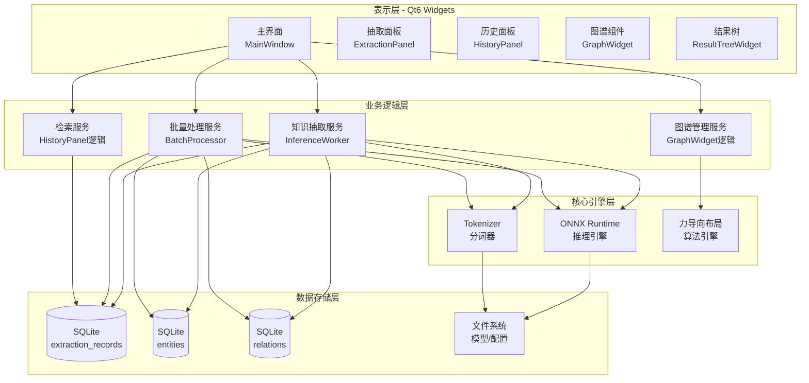

**架构说明：**
- 表示层：Qt框架实现，提供文本上传、图谱展示、检索面板、管理控制台。包括MainWindow主窗口、ExtractionPanel文本输入面板、HistoryPanel历史记录面板、GraphWidget知识图谱组件、ResultTreeWidget结果树组件。
- 业务逻辑层：包括知识抽取服务（InferenceWorker推理工作线程）、批量处理服务（BatchProcessor批量处理器）、图谱管理服务（GraphWidget布局计算和交互逻辑）、检索服务（HistoryPanel搜索筛选逻辑）。
- 核心引擎层：ONNX Runtime推理引擎执行深度学习模型推理，Tokenizer分词器基于tokenizers-cpp实现文本编码，力导向布局算法引擎计算知识图谱节点位置。
- 数据存储层：SQLite数据库存储extraction_records抽取记录表、entities实体表、relations关系表，文件系统存储ONNX模型文件、Tokenizer配置和Metadata元数据。

### 4.1.2 系统功能结构图

系统功能分为三大模块：知识抽取模块、知识管理模块、系统管理模块。

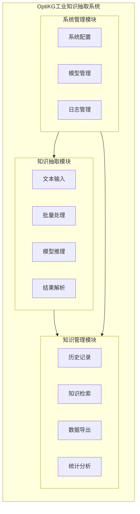

**功能模块说明：**
- 知识抽取模块：包含文本输入（支持直接输入和文件上传）、批量处理（支持CSV/JSON多文件处理）、模型推理（ONNX Runtime深度学习推理）、结果解析（实体识别和关系抽取）。
- 知识管理模块：包含历史记录（抽取结果的持久化存储）、知识检索（关键词搜索和筛选）、数据导出（JSON/CSV格式导出）、统计分析（记录数量、实体关系统计）。
- 系统管理模块：包含系统配置（阈值、字段映射等参数配置）、模型管理（ONNX模型热加载和切换）、日志管理（操作日志和错误追踪）。

## 4.2 数据库设计

### 4.2.1 实体分析

核心实体包括：抽取记录、实体、关系。实体间关系：抽取记录包含多个实体和多个关系，实体通过关系相互关联。

### 4.2.2 E-R图

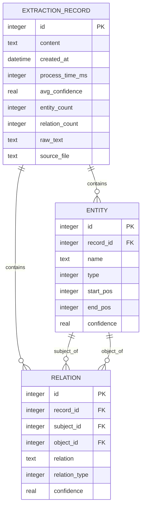

**实体关系说明：**
- 抽取记录(ExtractionRecord)：一次知识抽取的完整记录，包含原始文本、处理时间、统计信息。
- 实体(Entity)：从文本中识别的命名实体，包括部件、故障、工具、组成四种类型。
- 关系(Relation)：实体之间的关联关系，通过subject_id和object_id关联到实体表。
- 一个抽取记录包含多个实体（一对多），一个抽取记录包含多个关系（一对多），一个实体可以作为多个关系的主体或客体。

### 4.2.3 逻辑结构设计

主要表结构如下：

**表4-1 抽取记录表(extraction_records)**

| 字段名 | 类型 | 约束 | 说明 |
|--------|------|------|------|
| id | INTEGER | PRIMARY KEY AUTOINCREMENT | 记录ID |
| content | TEXT | NOT NULL | 原始文本内容 |
| created_at | DATETIME | NOT NULL | 创建时间 |
| process_time_ms | INTEGER | NOT NULL | 处理耗时(毫秒) |
| avg_confidence | REAL | NOT NULL | 平均置信度 |
| entity_count | INTEGER | NOT NULL | 实体数量 |
| relation_count | INTEGER | NOT NULL | 关系数量 |
| raw_text | TEXT | | 原始文本备份 |
| source_file | TEXT | | 来源文件路径 |

**索引：** idx_records_created_at ON created_at, idx_records_confidence ON avg_confidence

**表4-2 实体表(entities)**

| 字段名 | 类型 | 约束 | 说明 |
|--------|------|------|------|
| id | INTEGER | PRIMARY KEY AUTOINCREMENT | 实体ID |
| record_id | INTEGER | FOREIGN KEY | 所属记录ID |
| name | TEXT | NOT NULL | 实体名称 |
| type | INTEGER | NOT NULL | 实体类型(0-3) |
| start_pos | INTEGER | | 开始位置 |
| end_pos | INTEGER | | 结束位置 |
| confidence | REAL | NOT NULL | 置信度 |

**索引：** idx_entities_record_id ON record_id, idx_entities_type ON type

**表4-3 关系表(relations)**

| 字段名 | 类型 | 约束 | 说明 |
|--------|------|------|------|
| id | INTEGER | PRIMARY KEY AUTOINCREMENT | 关系ID |
| record_id | INTEGER | FOREIGN KEY | 所属记录ID |
| subject_id | INTEGER | FOREIGN KEY | 主体实体ID |
| object_id | INTEGER | FOREIGN KEY | 客体实体ID |
| relation | TEXT | NOT NULL | 关系名称 |
| relation_type | INTEGER | NOT NULL | 关系类型(0-3) |
| confidence | REAL | NOT NULL | 置信度 |

**索引：** idx_relations_record_id ON record_id, idx_relations_relation ON relation

**外键约束：** record_id引用extraction_records(id) ON DELETE CASCADE, subject_id和object_id引用entities(id) ON DELETE CASCADE

## 4.3 UI设计

系统主界面采用三栏布局：

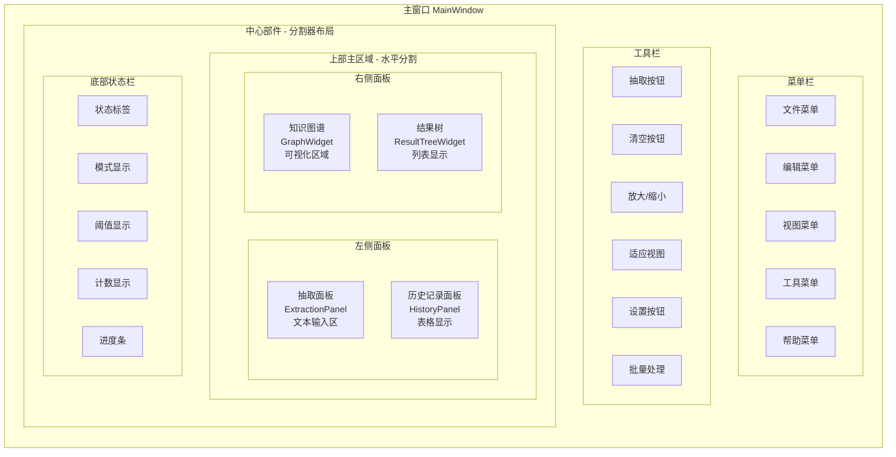

- 左侧导航栏：知识抽取、图谱浏览、知识检索、审核管理、系统设置；
- 中间内容区：根据功能展示相应内容（文件上传区、图谱展示区、检索结果列表等）；
- 底部状态栏：显示登录用户、模型版本、系统状态。

相关界面元素包括：文本输入框、抽取按钮、图谱视图、结果列表、历史表格、状态栏等。

## 4.4 网络设计

OptiKG定位为完全离线运行的系统，不依赖互联网连接。部署模式为单机部署，所有组件运行在同一台工业计算机上，不开放任何网络端口。如需与其他系统交换数据，通过离线文件（CSV/JSON）导入导出。后续引入openClaw Agent时，可部署在同一内网，通过本地HTTP服务交互。

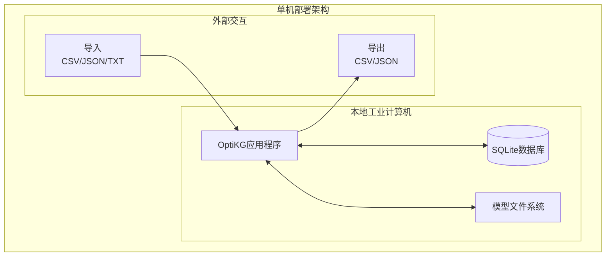

## 4.5 数据量分析

以中型企业为例：

- 用户数量：约20人；
- 文档数量：年新增约2000份，每份约300字；
- 三元组数量：每份约3个，年新增约6000条；
- 存储需求：文档存储约2MB/年，三元组存储约4MB/三年，模型文件约200MB，总计<250MB。普通工业计算机硬盘完全满足。

## 4.6 核心业务流程活动图

### 4.6.1 知识抽取模块活动图

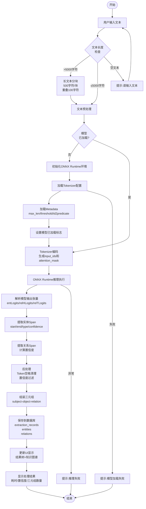

**主要活动说明：**
- 用户上传文本→文本长度检查（超过5000字符则分块）→文本预处理（转小写、trim、JSON解析）→模型加载（ONNX+Tokenizer+Metadata）→Tokenizer编码（生成input_ids和attention_mask）→ONNX模型推理→解码抽取结果（解析entLogits/relHLogits/relTLogits）→后处理（Token空格清理、置信度过滤）→组装三元组→写入数据库（extraction_records/entities/relations三张表）→生成处理报告→更新UI显示→提示完成。

### 4.6.2 批量处理模块活动图

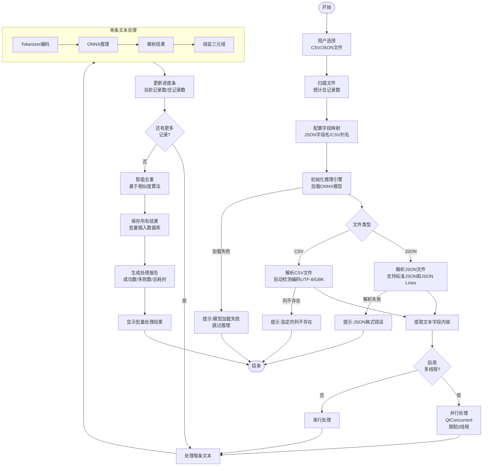

**主要活动说明：**
- 用户选择文件→扫描文件统计记录数→配置字段映射→初始化推理引擎→解析文件（JSON/CSV）→提取文本内容→多线程并行处理→每条文本执行推理→更新进度→智能去重→批量插入数据库→生成处理报告→显示结果。

### 4.6.3 知识管理模块活动图

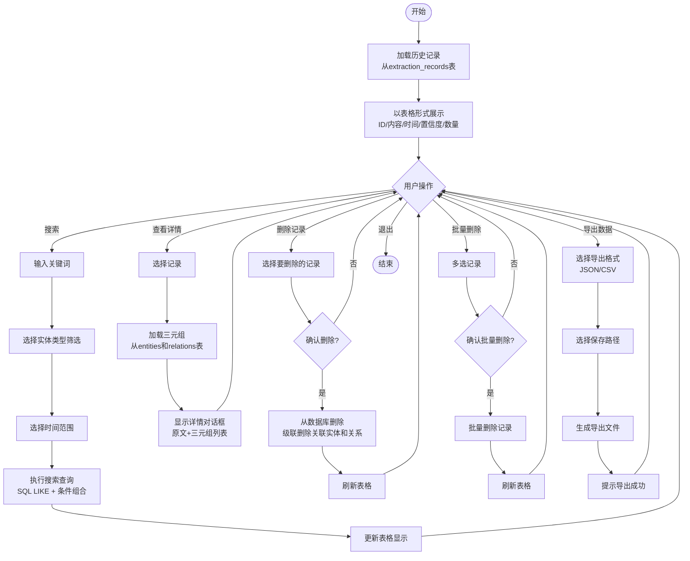

**主要活动说明：**
- 加载历史记录→表格展示→用户操作（搜索/查看/删除/导出）→搜索时执行SQL组合查询→查看时加载关联三元组→删除时级联删除关联数据→导出时生成JSON/CSV文件。

### 4.6.4 知识图谱展示模块活动图

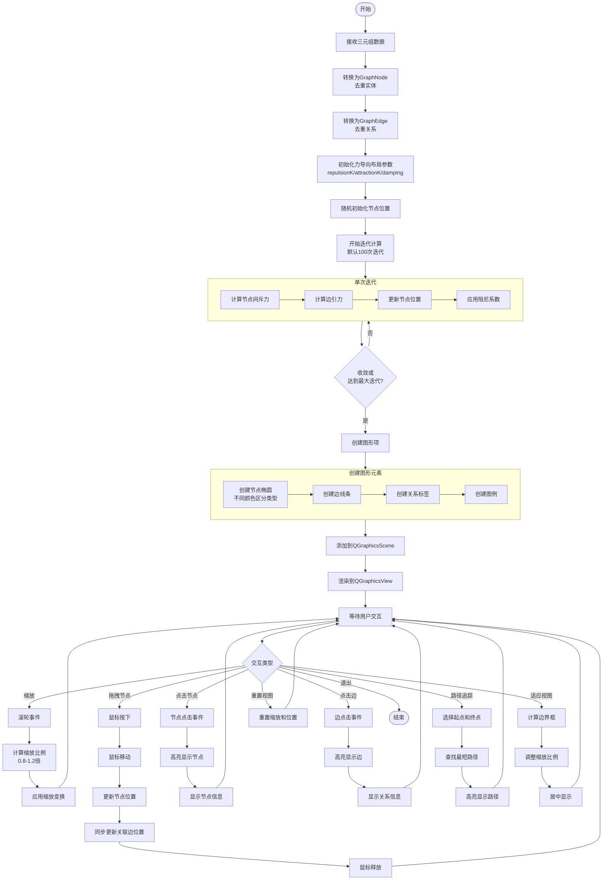

**主要活动说明：**
- 接收三元组数据→转换为GraphNode和GraphEdge（去重）→力导向布局计算（Fruchterman-Reingold算法，100次迭代）→创建图形元素（节点/边/标签/图例）→添加到场景渲染→等待用户交互→支持缩放/拖拽/点击高亮/路径追踪等交互操作。

### 4.6.5 历史记录管理模块活动图

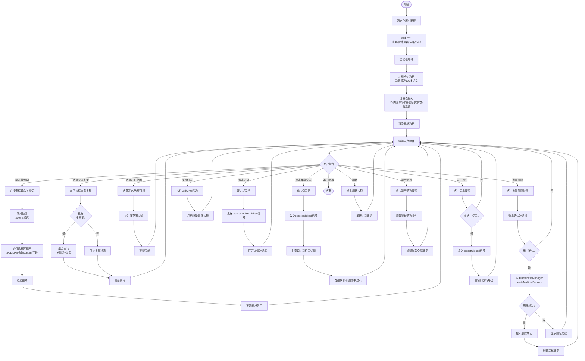

**主要活动说明：**
- 初始化面板→创建控件→加载数据→设置表格→等待用户操作→搜索（防抖300ms）→组合筛选→单击/双击查看→多选批量删除→导出数据→清空筛选→刷新数据。

### 4.6.6 数据导出模块活动图

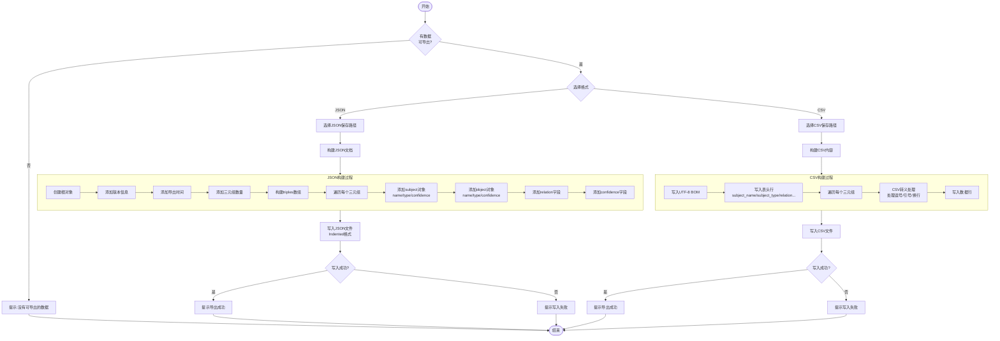

**主要活动说明：**
- 检查数据→选择格式（JSON/CSV）→构建文档→JSON包含版本/时间/数量/triples数组→CSV包含UTF-8 BOM和表头→CSV转义处理特殊字符→写入文件→提示成功/失败。

### 4.6.7 系统配置模块活动图

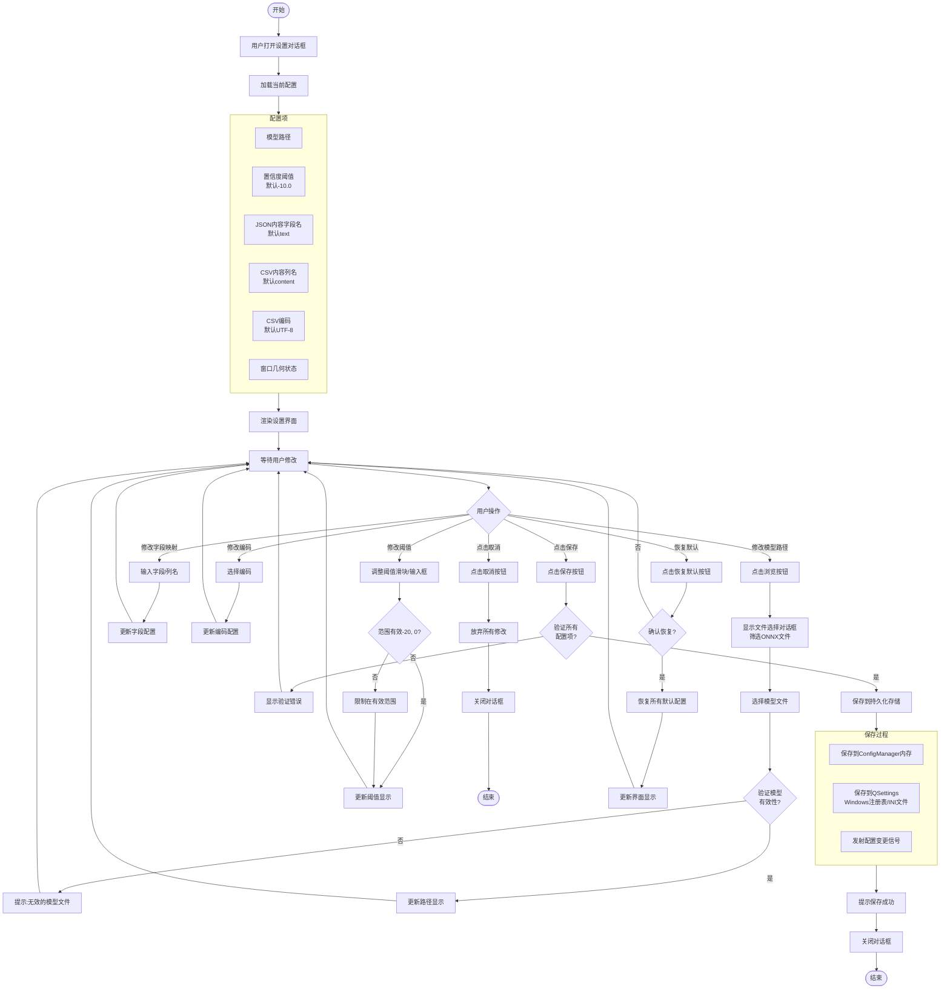

**主要活动说明：**

- 打开设置→加载当前配置→渲染界面→等待修改→修改模型路径（浏览选择并验证）→修改阈值（限制范围[-20,0]）→修改字段映射→修改编码→保存时验证→保存到QSettings→发射变更信号→或取消/恢复默认。

