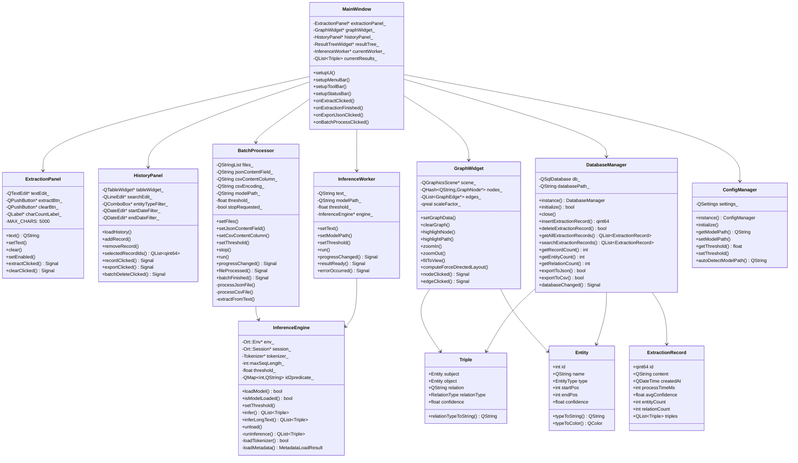
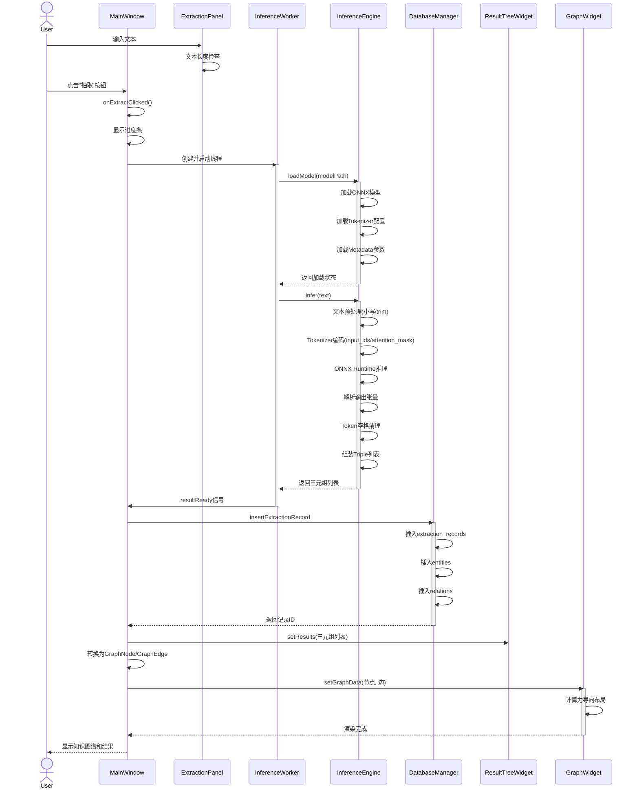
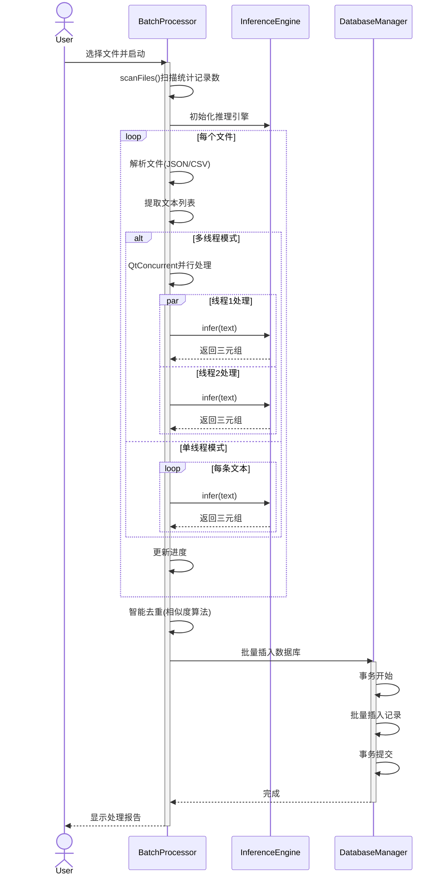
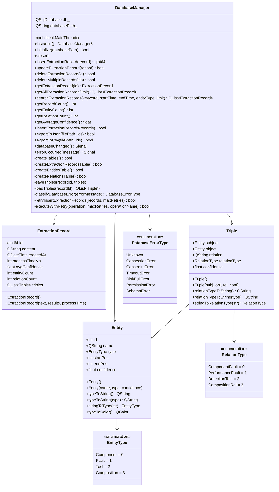
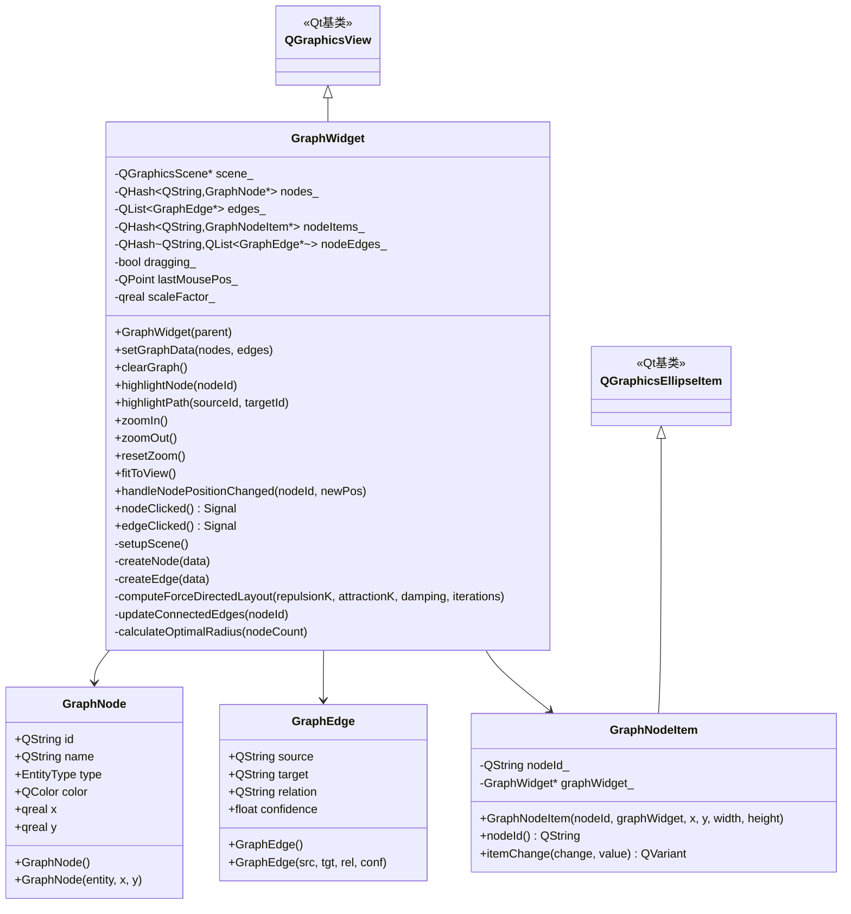
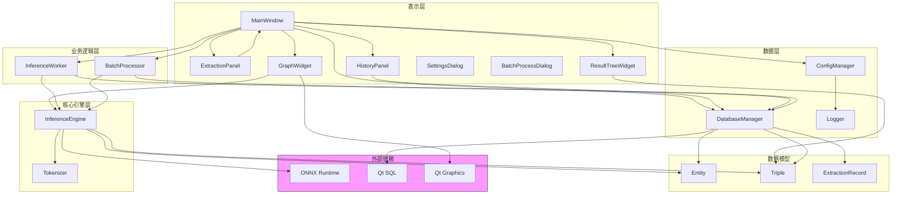

SourceURL:file:///home/arch/Downloads/软件工程大作业.docx

# 第5章 编码实现

## 5.1 开发环境与工具

| 项目         | 说明                      |
| ------------ | ------------------------- |
| 操作系统     | Windows 11                |
| 集成开发环境 | Clion                     |
| 编程语言     | C++17                     |
| GUI框架      | Qt 6.11                   |
| 深度学习推理 | ONNX Runtime 1.24         |
| 数据库       | SQLite 3                  |
| 版本控制     | Git，托管于Github私有仓库 |

## 5.2 核心模块实现

### 5.2.1 系统核心类图

**类图说明：**
- **MainWindow**：主窗口类，协调各模块交互，管理UI组件
- **ExtractionPanel**：抽取面板，处理文本输入和抽取触发
- **HistoryPanel**：历史面板，管理历史记录的展示和操作
- **GraphWidget**：图谱组件，负责知识图谱的渲染和交互
- **InferenceWorker**：推理工作线程，封装后台推理流程
- **InferenceEngine**：推理引擎核心，执行ONNX模型推理
- **BatchProcessor**：批量处理器，支持多文件批量处理
- **DatabaseManager**：数据库管理单例，封装所有数据库操作
- **Entity/Triple/ExtractionRecord**：数据模型结构体
- **ConfigManager**：配置管理单例，管理应用配置

### 5.2.2 知识抽取模块时序图

**时序说明：**
1. 用户在ExtractionPanel输入文本并点击抽取
2. MainWindow创建InferenceWorker线程
3. InferenceWorker加载InferenceEngine模型（懒加载）
4. 执行推理：文本预处理→Tokenizer编码→ONNX推理→结果解析
5. 返回结果后保存到DatabaseManager（三张表）
6. 更新ResultTreeWidget和GraphWidget显示

### 5.2.3 批量处理模块时序图

**时序说明：**
1. 用户选择多个文件启动批量处理
2. 扫描阶段统计总记录数用于进度显示
3. 根据配置选择串行或并行处理模式
4. 多线程模式使用QtConcurrent限制2线程
5. 处理完成后执行智能去重
6. 使用数据库事务批量保存结果

### 5.2.4 数据库操作类图

**类图说明：**
- **DatabaseManager**：单例模式，封装所有数据库操作，使用QSqlDatabase连接SQLite
- **ExtractionRecord**：抽取记录数据结构，包含元数据和三元组列表
- **Entity**：实体数据结构，包括名称、类型、位置、置信度
- **Triple**：三元组数据结构，包含主体、客体、关系、置信度
- **DatabaseErrorType**：数据库错误类型枚举，用于错误分类处理
- **EntityType/RelationType**：实体和关系类型枚举，与代码中一致

### 5.2.5 知识图谱渲染类图

**类图说明：**
- **GraphWidget**：继承QGraphicsView，负责知识图谱的渲染和交互
- **GraphNode**：图谱节点数据结构，包含位置、颜色、类型信息
- **GraphEdge**：图谱边数据结构，包含源节点、目标节点、关系信息
- **GraphNodeItem**：继承QGraphicsEllipseItem，自定义节点图形项，支持拖拽
- 使用力导向布局算法自动计算节点位置

### 5.2.6 模块依赖关系图

**依赖说明：**
- **UI层**：MainWindow协调各UI组件，依赖业务逻辑层和数据层
- **业务逻辑层**：InferenceWorker和BatchProcessor依赖InferenceEngine执行推理，依赖DatabaseManager保存结果
- **核心引擎层**：InferenceEngine封装ONNX Runtime和Tokenizer，处理核心推理逻辑
- **数据层**：DatabaseManager使用Qt SQL操作SQLite，ConfigManager管理配置，Logger记录日志
- **数据模型**：Entity、Triple、ExtractionRecord在各层间传递数据
- **外部依赖**：ONNX Runtime提供推理能力，Qt SQL提供数据库访问，Qt Graphics提供图形渲染

### 5.2.7 核心模块实现说明

**知识抽取模块实现：**
- **InferenceEngine**：核心推理类，封装ONNX Runtime推理流程
  - `loadModel()`：加载ONNX模型、Tokenizer配置、Metadata参数
  - `infer()`：单条文本推理，返回三元组列表
  - `inferLongText()`：长文本分块处理，智能去重
  - `runInference()`：执行实际推理，解析模型输出张量
  
- **InferenceWorker**：QThread子类，后台执行推理避免UI阻塞
  - 接收文本和模型路径配置
  - 异步执行推理，通过信号返回结果
  - 支持进度反馈和错误处理

- **BatchProcessor**：批量处理线程，支持多文件并行处理
  - 扫描文件统计记录数
  - 支持JSON/CSV格式解析
  - 多线程并行处理（限制2线程）
  - 智能去重和批量保存

**知识图谱展示模块实现：**
- **GraphWidget**：知识图谱可视化组件
  - 接收GraphNode和GraphEdge数据
  - 执行力导向布局算法
  - 渲染节点、边、标签
  - 处理鼠标交互（缩放、拖拽、点击）

- **GraphNode/GraphEdge**：图谱数据结构
  - 从Triple转换生成
  - 去重处理避免重复节点

- **GraphNodeItem**：自定义图形项
  - 继承QGraphicsEllipseItem
  - 支持拖拽移动
  - 实时更新关联边位置

**数据库管理模块实现：**
- **DatabaseManager**：单例模式数据库访问类
  - 初始化SQLite数据库连接
  - 创建三张核心表（extraction_records、entities、relations）
  - 提供CRUD操作和批量操作
  - 支持导出JSON/CSV
  - 错误处理和重试机制

**配置管理模块实现：**
- **ConfigManager**：单例模式配置管理类
  - 使用QSettings持久化存储
  - 管理模型路径、置信度阈值、字段映射等配置
  - 支持自动检测模型路径
  - 配置变更信号通知

## 5.3 UI界面截图

以下为系统主要界面截图示例（实际报告中插入真实截图）：

- 图5-1 登录界面

- 图5-2 知识抽取界面

- 图5-3 图谱浏览界面

- 图5-4 知识检索界面

- 图5-5 审核管理界面

演示视频（时长约3分钟）单独提交。

